Updated <time datetime="2026-04-08T12:00:00.000Z">April 8, 2026</time>

###### Let's talk about app hosting

We made a post back in 2025, highlighting the platforms you might never hear about, you can check it out [clicking here](/blog/deployment-platforms).

BUT! It is 2026 and a lot has happened in the scene since, so we decided to create a fresh article going over other options, we suspect you haven't heard about.

---

We will be presenting you with different hosting platforms that aim to make the process of hosting apps, as easy as Vercel or Netlify, but without the baggage of being Vercel or Netlify.

## Table of contents

- [FastAPI Cloud](#fastapi-cloud)
- [VibeOps](#vibeops)
- [seenode](#seenode)
- [Zerops](#zerops)
- [Juno](#juno)
- [WispByte](#wispbyte)
- [Bult](#bult)
- [Summary](#summary)
- [References](#references)

---

## FastAPI Cloud

> **"You code. We cloud."**

https://fastapicloud.com/

The FastAPI Cloud is a platform created to help Python devs using FastAPI host their apps and APIs with a single terminal command and built by Tiangolo himself, the creator of FastAPI, plus a small team who have been involved in the FastAPI/Python ecosystem.

At the time of writing, FastAPI Cloud is in **private beta** with a waitlist, so we are lucky to have gotten access to it early!

The main focus with this tool is *simplicity*:

- You run `fastapi deploy` from the root of your FastAPI project
- And... that's it basically...

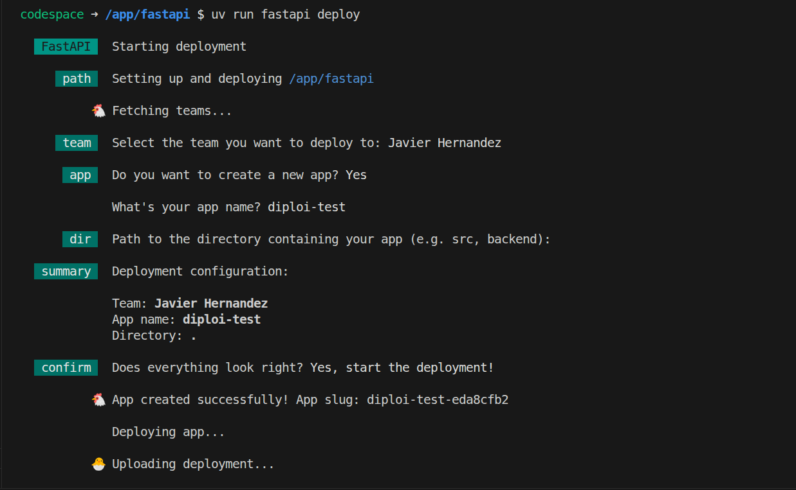

I mean, you have to go through a very minimal setup wizard, type a name for your deployment or use an existing one, and you are set. Your app goes live with a `fastapicloud.dev` domain. The CLI command to use FastAPI Cloud, comes bundled with `fastapi[standard]`, meaning every FastAPI developer already has the deployment tool installed. To make fullstack hosting even smoother, the platform comes with some integrations with **Neon, Redis, and Supabase** out of the box, with HuggingFace coming soon.

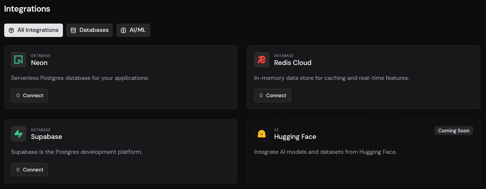

There are a lot of features still under development, so it's not ready for production, but it's a good initiative, since Python's hosting tooling is not as neat as what's available in the JavaScript ecosystem.


| Detail | Info |
|--------|------|
| **Pricing** | For now, it is free |
| **Free tier or trial available?** | Everything is free for now |
| **Video demo** | <iframe width="560" height="315" src="https://www.youtube.com/embed/asohRlMn72I?si=q4by5xxyiLMZPW1e" title="FastAPI Cloud reveal" frameborder="0" allow="accelerometer; autoplay; clipboard-write; encrypted-media; gyroscope; picture-in-picture; web-share" referrerpolicy="strict-origin-when-cross-origin" allowfullscreen></iframe> |

---

## VibeOps

> **"Go live without legal panic, leaking Stripe keys, getting hacked, surprise bills, hiring DevOps."**

https://vibeops.tech/

Like "vibe coding" but for DevOps, well, that's basically what VibeOps is working on. They make it easy to host apps built with tools like **Lovable, Replit, and Cursor**. Besides hosting, VibeOps runs security scans before deploying, looking for known vulnerabilities, which was a nice surprise.

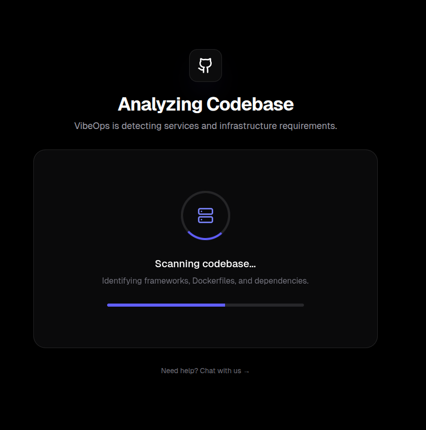

Across your deployments, you have access to an infrastructure AI assistant, so you can ask questions about your project's configuration and it can remediate issues without requiring you to make edits manually, but I couldn't get it to work for a project I tried hosting.

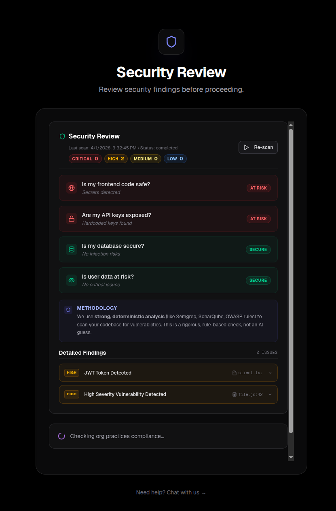

I need to point out that although VibeOps has a nice UI and some features that are quite interesting, not everything was working as expected during my test, so I believe that they are still in an early stage.

| Detail | Info |
|--------|------|
| **Pricing** | Start from $5/month + build sessions + network egress + hosted routes |
| **Free tier or trial available?** | They don't disclose any free tiers, but you get a free trial when you register |
| **Video demo** | <iframe width="560" height="315" src="https://www.youtube.com/embed/z2Kv5Dgvau0?si=gTHXz4mxNx0EB478" title="VibeOps intro" frameborder="0" allow="accelerometer; autoplay; clipboard-write; encrypted-media; gyroscope; picture-in-picture; web-share" referrerpolicy="strict-origin-when-cross-origin" allowfullscreen></iframe> |

---

## seenode

> **"Deploy your app. Sign up later."**

https://seenode.com/

Similar to VibeOps, seenode's goal is to simplify how devs host their projects. It supports **Python, Node.js, Golang, and Elixir** for web services and workers, along with managed **PostgreSQL and MySQL** databases.

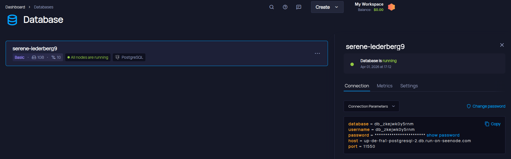

I tested importing a dummy project created with Lovable, and another built using FastAPI, and the process was smooth enough. You need to define the build and run commands, and that's pretty much it.

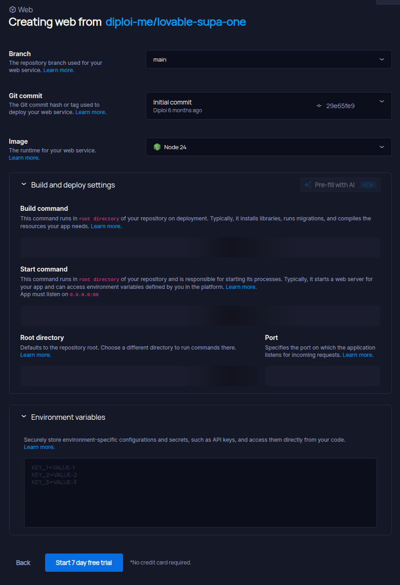

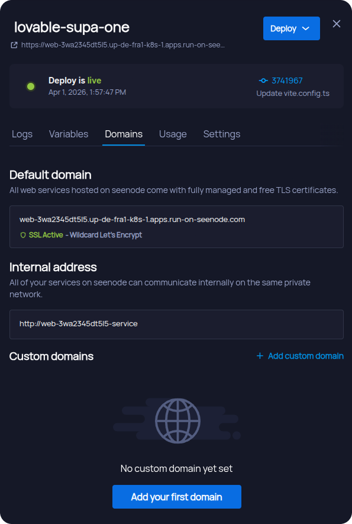

| Detail | Info |
|--------|------|
| **Pricing** | Charge per usage, starting from $0.004/hour for web services/workers, $0,005/hour for databases and $0.5/GB/month for persistent storage |
| **Free tier or trial available?** | 7-day free trial without credit card |
| **Video demo** | <iframe width="560" height="315" src="https://www.youtube.com/embed/2GFdlz8bNbY?si=7PGOQ8LVhXWZIGkM" title="seenode video intro" frameborder="0" allow="accelerometer; autoplay; clipboard-write; encrypted-media; gyroscope; picture-in-picture; web-share" referrerpolicy="strict-origin-when-cross-origin" allowfullscreen></iframe> |

---

## Zerops

> **"Cloud that respects developers — human and AI."**

https://zerops.io/

Zerops is an ambitious platform and began as an internal project at [vshosting.eu](https://vshosting.eu/). Unlike most PaaS providers that run on AWS or GCP, Zerops operates on its own servers with custom-built networking.

All build containers are created using Incus, rather than Docker containers, so you don't need to depend on external tooling like GitHub Actions to generate app builds, as these can be run locally or using external runners.

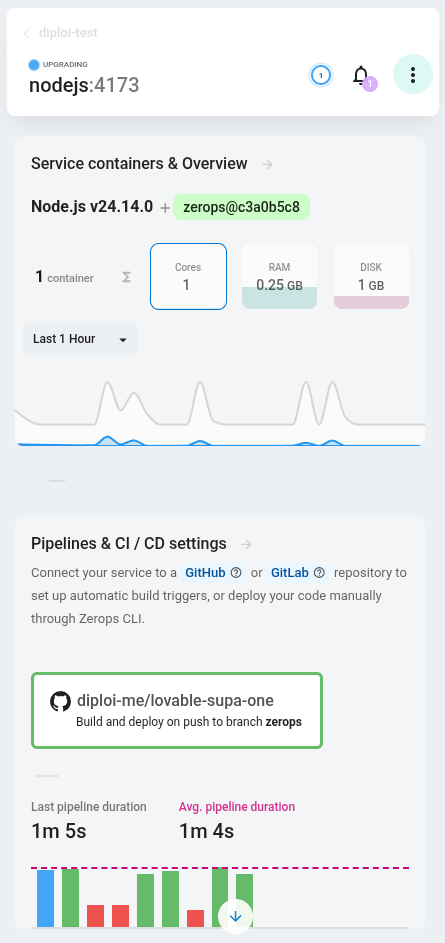

The core part of how Zerops operates is the `zerops.yml` which is their answer for infrastructure as code, and provides you with a declarative way to configure your apps with minimal overhead. You can start from zero using one of their maintained app templates or by importing your existing projects from GitHub or GitLab by creating a `zerops.yml` file at the root of your repository.

```yaml
# Example file for a node app
zerops:
  - setup: nodejs
    build:
      base: nodejs@24

      buildCommands:
        - npm i
        - npm run build

      deployFiles:
        - dist
        - package.json
        - node_modules

      cache:
        - node_modules
        - package-lock.json

    run:
      base: nodejs@24

      ports:
        - port:  5173
          httpSupport: true

      start: npm run start
```

The way Zerops handles CI/CD pipeline setups is also linked to this file. Once you have the `zerops.yml` in your repository, and connect it to a web service, you can choose to update your live build either on every push to a specific branch or by adding a custom tag to your commits.

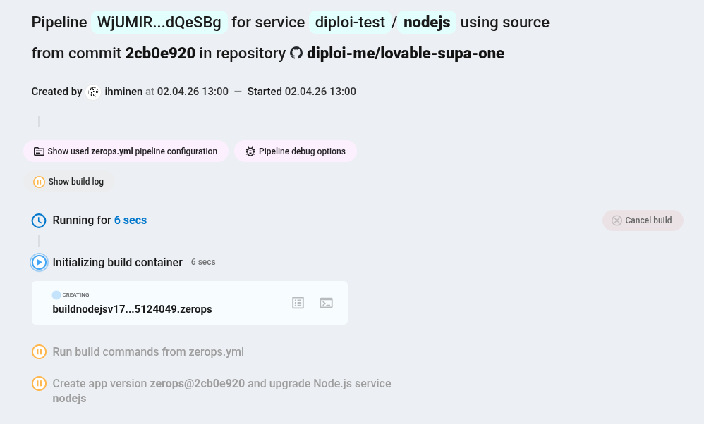

There is a broad selection of languages/frameworks, databases, and services available, so you can host fullstack apps with all they need hosted in the same project as containers. The full list includes:

- Runtimes and Web Servers:
    - Node.js
    - PHP
    - Python
    - Go
    - .NET
    - Rust
    - Java
    - Deno
    - Bun
    - Elixir
    - Gleam
    - Nginx static
    - Static
- Linux Containers and VMs:
    - Ubuntu
    - Alpine
    - Docker
- Databases, Search Engines, and Message Brokers:
    - PostgreSQL
    - MariaDB (MySQL)
    - Valkey (Redis)
    - Elasticsearch
    - Typesense
    - Meilisearch
    - Qdrant
    - NATS
    - Kafka
    - Clickhouse
    - KeyDB
- Storage:
    - Object Storage
    - Shared Storage

| Detail | Info |
|--------|------|
| **Pricing** | Usage-based billing, starting at $0,0008/core/hour for shared CPU and $0.0083/core/hour for dedicated CPU, RAM $0.0041/GB/hour, and $0,0001GB/hour. You can get an estimation on their documentation page [docs.zerops.io/company/pricing](https://docs.zerops.io/company/pricing). |
| **Free tier or trial available?** | $15 free credits on signup and they offer a free tier which gives you 15 build hours, 100 GB egress, and 5GB of backup storage. |
| **Video demo** | <iframe width="560" height="315" src="https://www.youtube.com/embed/gRidFn-51jM?si=kGa96HO-G2Jl7fDn" title="Zerops introduction" frameborder="0" allow="accelerometer; autoplay; clipboard-write; encrypted-media; gyroscope; picture-in-picture; web-share" referrerpolicy="strict-origin-when-cross-origin" allowfullscreen></iframe> |

---

## Juno

> **"Build serverless apps with self-hosting control."**

https://juno.build/

Juno links the blockchain world with hosting, by running entirely on the Internet Computer (ICP) blockchain. If you are like me, hearing "blockchain" doesn't translate to trust, but this platform is definitely a good use case of the word!

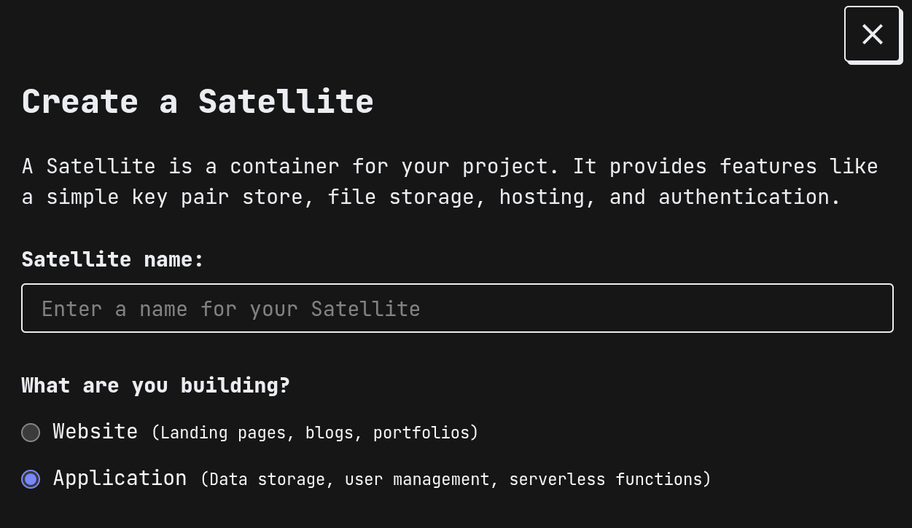

Every project hosted on Juno, creates a **"Satellite"**, which is a smart contract in the ICP blockchain, using WebAssembly to run, and developers own ir like they would own an NFT. Even if Juno itself disappeared, Satellites should, in theory, continue running independently on the blockchain.

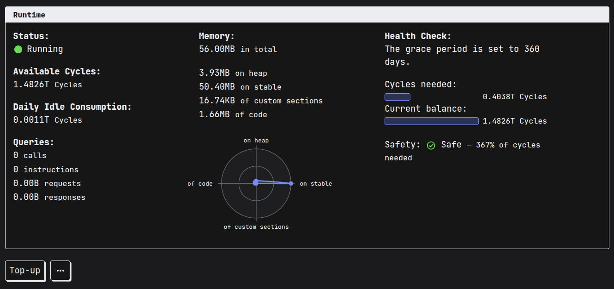

Using Juno, you can host frontend applications, along with built-in serverless functions and additional services. After trying Juno, the experience reminds me of Supabase, where you have commonly used services, provisioned with minimal configuration work required. Juno comes with six core services:

- **Authentication**, which allows you handle user auth through [Internet Identity](https://id.ai/), passkeys, Google Sign-In, and Github.
- **Datastore** is a minimal, database-like storage solution, for key-value pair entries, where you can save application data. This is only accessible from within the deployed Satellite.
- **Storage** provides a way to store files like images, documents and other binary files. The stored files can be accessible via URL.
- **Hosting**, where you can add custom domains and view the active endpoints for your Satellite.
- **Functions** allow you to run serverless functions using Rust or TypeScript, either as [event-driven or callable functions](https://juno.build/docs/build/functions/).
- **Analytics**, which provides basic metrics, like the number of sessions and page views, while not using cookies or adding invasive tracking.

| Detail | Info |
|--------|------|
| **Pricing** | Usage-based, charged [using the Cycle cryptocurrency](https://juno.build/docs/pricing). On average, you are expected to pay ~$5/year per GB and about ~$13/year to host an application. |
| **Free tier or trial available?** | New users get 1,5T Cycles to launch a trial Satellite. |
| **Video demo** | <iframe width="560" height="315" src="https://www.youtube.com/embed/t3RtJ-ezGCw?si=fOeL4TO2QL_OJ84-" title="Introduction to Juno" frameborder="0" allow="accelerometer; autoplay; clipboard-write; encrypted-media; gyroscope; picture-in-picture; web-share" referrerpolicy="strict-origin-when-cross-origin" allowfullscreen></iframe> |

---

## WispByte

> **"A Byte of Possibility."**

Not your usual hosting platform, since it's focused mainly on hosting Discord bots and Minecraft servers. WispByte is one of the few hosting providers with a totally free tier, that you can use to host a single server, using any of their supported runtimes, which include NodeJS, Bun, Python, Java, C#, Rust, and Lua.

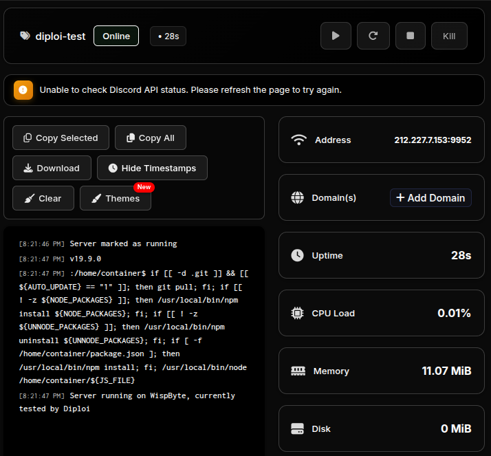

Besides allowing you to run web apps, you can also host MongoDB, MariaDB, Redis, and PostgreSQL databases. On WispByte, you get one server per runtime or database hosted, so you can't host fullstack applications using a single server.

| Detail | Info |
|--------|------|
| **Pricing** | Has multiple tiers, starting from €3.99/year for Discord bots, 2.99/month for Hytale or €1.99/month for Minecraft servers. |
| **Free tier or trial available?** | Yes, they offer a free tier, with 512 MB RAM, 1 GB storage. |
| **Video demo** | <iframe width="560" height="315" src="https://www.youtube.com/embed/HxuJuS9BthQ?si=kiqavxhKk-WdMRK_" title="WispByte short tutorial" frameborder="0" allow="accelerometer; autoplay; clipboard-write; encrypted-media; gyroscope; picture-in-picture; web-share" referrerpolicy="strict-origin-when-cross-origin" allowfullscreen></iframe> |

---

## Bult

> **"Deploy Fast, Build Without Limits."**

With a signature UI, that replaces YAML files and CLI commands for infrastructure management, somewhat similar to Railway, Bult is one of the few platforms we reviewed here that comes with an AI deployment agent, which analyses your app to help you host with minimal configuration.

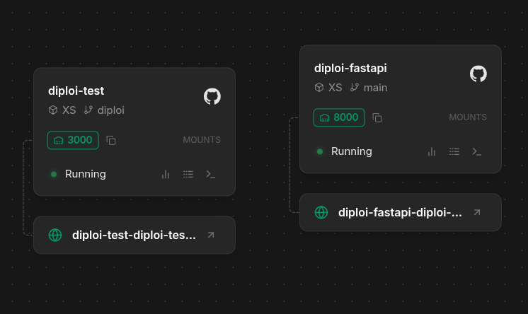

Bult allows you to host fullstack projects within a single workspace, where you can add web services from GitHub or using Docker, databases, volumes, and connections. Additionally, Bult has templates for services and tools, like RabbitMQ and n8n.

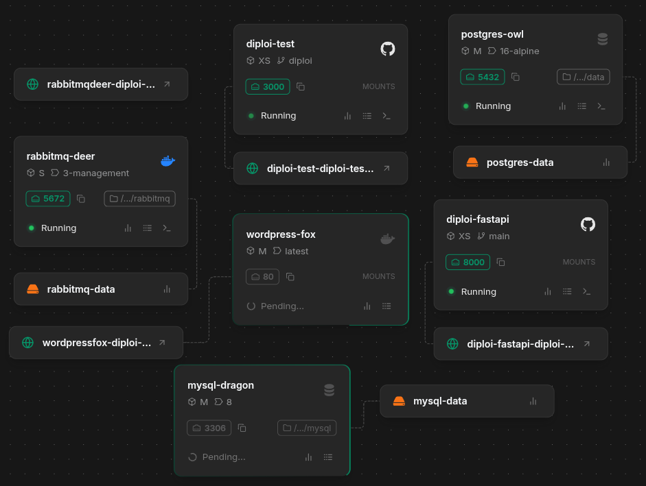

| Detail | Info |
|--------|------|
| **Pricing** | Starts from $5/month + $5 free credits |
| **Free tier or trial available?** | Free trial with $5 in free credits |
| **Video demo** | <iframe width="560" height="315" src="https://www.youtube.com/embed/YdTwFjXZDGQ?si=2iUJNsDtAwi9I4ad" title="Bult intro" frameborder="0" allow="accelerometer; autoplay; clipboard-write; encrypted-media; gyroscope; picture-in-picture; web-share" referrerpolicy="strict-origin-when-cross-origin" allowfullscreen></iframe> |

---

## Summary

| Platform | Free tier | Starting price | Open source | Primary audience |
|----------|-----------|---------------|-------------|-----------------|
| **FastAPI Cloud** | Free during beta | TBA | No | FastAPI/Python developers |
| **VibeOps** | Trial on registration | $5/month + extras | No | Vibe-coded/AI app builders |
| **seenode** | 7-day trial, no CC | $0.004/hr (web services) | No | Full-stack developers |
| **Zerops** | $15 credits + free tier | ~$0.0008/core/hr | CLI + recipes | Full-stack developers |
| **Juno** | One trial app with 1.5T free Cycles | ~$13/yr per app | Fully open-source | Web3/decentralized builders |
| **WispByte** | 512 MB free forever | €3.99/yr | No | Discord bot/Minecraft operators |
| **Bult** | $5 free credits | $5/month | No | Indie devs, small teams |

If you have noticed by now, we tried not to have an opinion about each of these platforms, since our main goal is to raise awareness about the fact that there's more out there than Vercel or AWS, and you should try them.

All seven platforms let solo devs and teams focus on code instead of config, they just make different trade-offs to get there.

---

If you try any of these out, please let us know on [Discord](https://discord.com/invite/vvgQxVjC8G)! ☺️

---

And just in case, [test-drive Diploi 🌚](https://diploi.com/)

---

## References

- [FastAPI Cloud](https://fastapicloud.com/)
- [VibeOps](https://vibeops.tech/)
- [seenode](https://seenode.com/)
- [Zerops](https://zerops.io/)
- [Juno](https://juno.build/)
- [WispByte](https://wispbyte.com/)
- [Bult](https://bult.dev/)
- [Deployment platforms to try in 2025](/blog/deployment-platforms)
