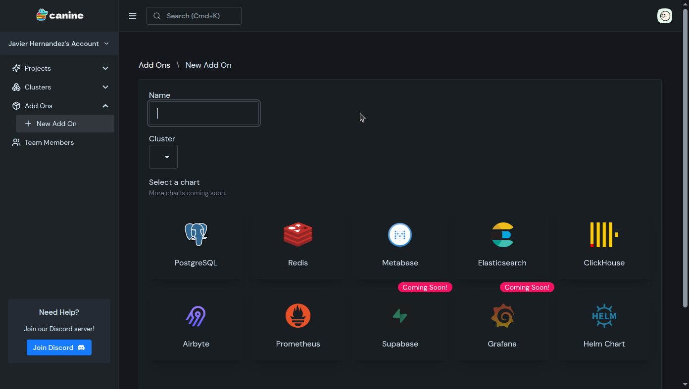
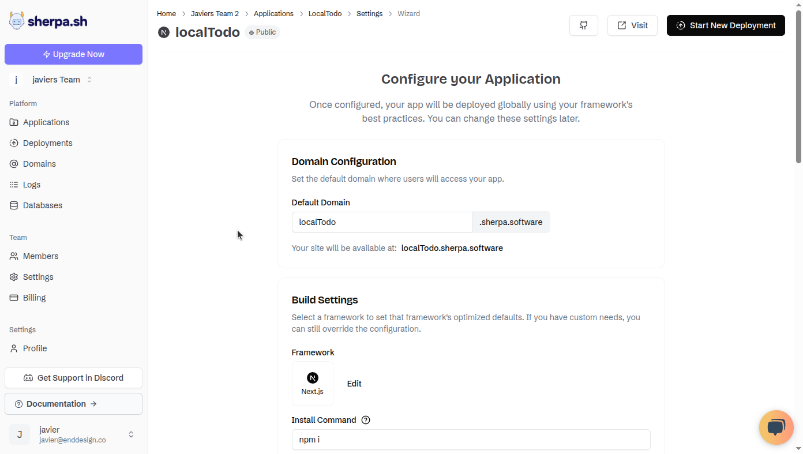
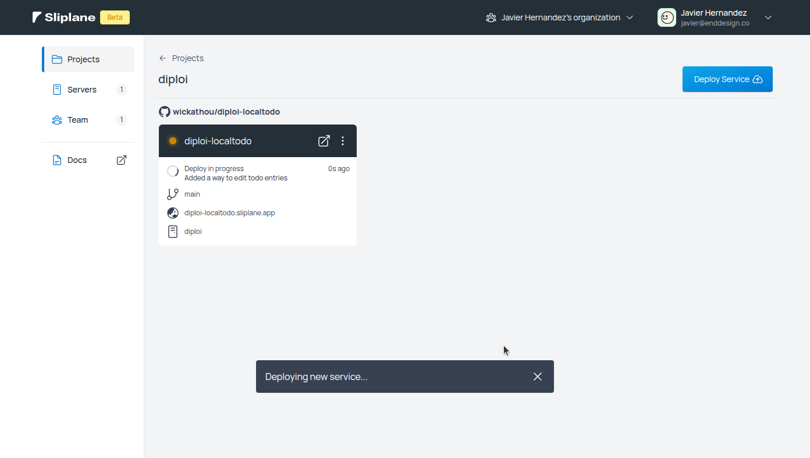
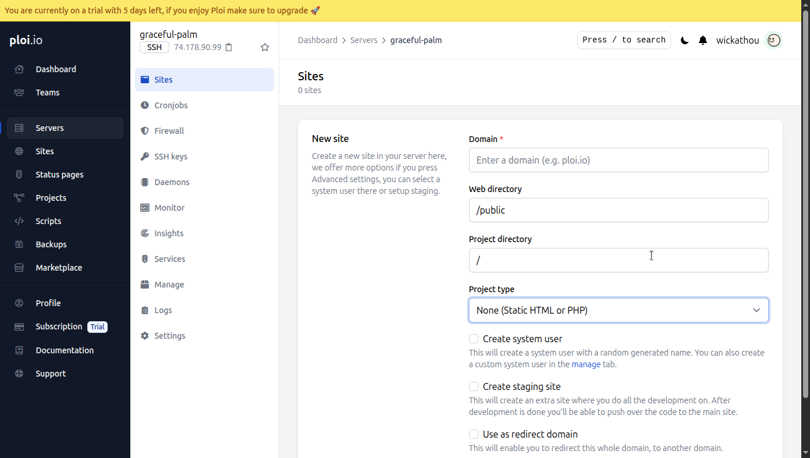
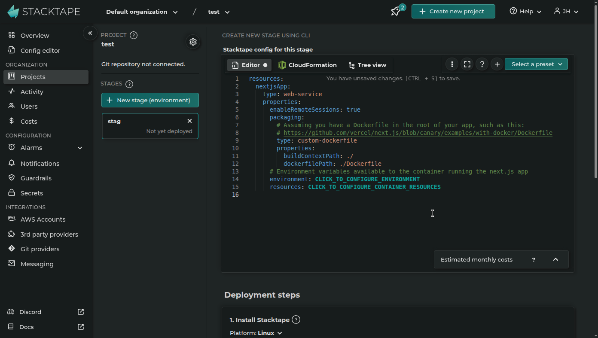
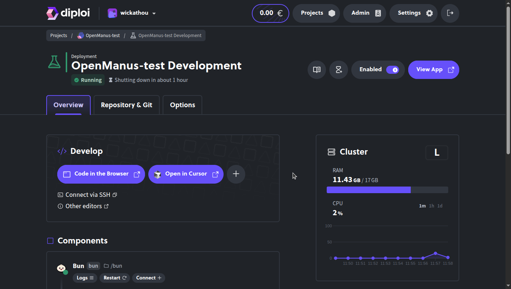

###### DevOps can be painful. We know from experience 🤕

###### So we decided to create a list of new deployment platforms (us included) that aim to make the process of hosting your application online a smooth and maybe even enjoyable process

---

By now you know both the big boys, like Azure, and you also probably know other platforms focused on making DevOps for non-DevOps people into a bearable experience, eg. Netlify, etc

But I bet that you probably don't know the ones I'll present now, and I hope you find them useful, reliable, interesting, and maybe even in some cases, whimsical 😌

Let's get started!

---

## Canine

https://canine.sh/

> "A modern, open source alternative to Heroku"

Canine is an open-source platform designed to simplify deploying apps to Kubernetes, similar to how Heroku simplifies app deployment. Created to fight the growing complexity and cost of IT infrastructure, especially with the addition of tools and vendors, many of which have open-source alternatives

Canine addresses these challenges by providing a streamlined, Kubernetes-based solution that abstracts away much of the complexity, allowing small teams to manage their infrastructure more efficiently. It focuses on essential Kubernetes features and integrates with third-party applications via Helm charts. The goal is to minimize complexity, reduce costs, and manage infrastructure for developers

### Provides managed servers or clusters?

No, you must host your server or cluster separately

### Anything free?

100% open source platform and currently free

### Pricing?

For now, Canine is totally free

### Something else?

Canine has add-ons that allow you to launch additional services, like Metabase or Elasticsearch on any cluster managed through Canine

### Video demo?

https://youtu.be/2m2osV-eBE4?feature=shared

---

## Sherpa

https://www.sherpa.sh/

> "Deploy Sveltekit/Next.js/React/Docker Apps The Easy Way"

Sherpa is a deployment platform designed to simplify the process of building, deploying, and scaling applications globally with significantly lower costs compared to competitors like Vercel and Netlify. It supports Next.js, Sveltekit, React, PayloadCMS, and Dockerized applications

Another interesting fact about Sherpa is its pricing, which offers flat rates with no additional charges for seats or projects, and its competitive pricing is achieved by running its own servers and partnerships with Hetzner for global infrastructure, instead of relying on cloud providers like AWS

### Provides managed servers or clusters?

Yes, Sherpa provides its own servers and uses Hetzner for global provisioning

### Anything free?

Sherpa offers a free trial period and allows you to host 1 application

### Pricing?

Starts with us$14.99 per month or us$119.88 per year for the Hobby plan. Sherpa offers 5 different pricing tiers for teams and enterprise

### Something else?

Sherpa offers unlimited Edge requests, so you can scale freely without forced costly upgrades

### Video demo?

https://youtu.be/-RhWwr9xy48?si=kTs6Ef44BrXvDxx_

---

## Sliplane

https://sliplane.io/

> "Simple Docker Hosting Solution"

Sliplane is a platform for deploying containerized applications, handling tasks like building images, running containers, health checks, and environment management. It offers continuous deployment by integrating with GitHub repositories and allows direct deployment from Docker Hub

You are charged based on the servers you use, which are provided by Hetzner, with pricing starting at €9 per month plus VAT, which allows you to host unlimited containers on each server. The platform also provides tools for log monitoring, secrets management, and secure server configuration

### Provides managed servers or clusters?

Yes, Sliplane uses Hetzner to provide servers to run Docker containers

### Anything free?

Sliplane offers a trial period so you can test out their service

### Pricing?

Servers start at €9 per month for their smallest server

### Something else?

Sliplane has an API, which allows you to control their deployments and launch servers without a GUI

### Video demo?

https://www.youtube.com/watch?v=svUdXGQwtMs

---

## Ploi

https://ploi.io/

> "Deploy your next server in a few clicks."

Ploi is a server management platform designed to simplify DevOps for developers. You can add a server you want to manage, using any of their native integrations, like Hetzner and UpCloud, or using any custom server, eg. AWS or Azure, which can be done by adding Ploi's public SSH key to your custom server

After adding a server, Ploi first takes care of the configuration required for your server to host an application. Once the configuration process is complete, you can add "sites" which is where you manage the apps that will be hosted on a server

Additionally, Ploi has a marketplace where you can add custom scripts, which expand what's possible, eg. Installing Docker with a single click, allowing you to add additional services and utilities without directly accessing your server via SSH

### Provides managed servers or clusters?

No, you can either add API access to one of the cloud providers supported by Ploi to launch servers quickly or you can launch a server on other cloud providers and use Ploi to manage it

### Anything free?

Ploi has a free 5-day trial, which lets you try out most features of the product, excluding server monitoring and team management features

### Pricing?

Ploi's service starts at €8 per month for the basic plan

### Something else?

Ploi also offers a version of their platform, designed for web hosting companies who want to provide a better user experience for their customers

https://ploi-core.io/

### Video demo?

https://www.youtube.com/watch?v=z4mr130YEAQ

---

## Stacktape

https://stacktape.com/

> "97% of AWS capabilities, 3% complexity"

Stacktape is a deployment tool that automates the process of deploying applications on AWS by breaking it into several phases: resolving and validating configuration, building and packaging code, creating initial resources, uploading artifacts, and deploying infrastructure

It uses AWS CloudFormation to manage infrastructure resources and offers features like caching, parallel uploads, and a hot swap mode to speed up deployments. In practice, you write a `stacktape.yml` file in your repo (choosing things like Lambdas, containers, and databases), and Stacktape builds the necessary CloudFormation under the hood

Stacktape also ensures consistent naming conventions for resources and provides a console for inspecting deployed resources and CloudFormation templates. Additionally, it supports third-party services through CloudFormation extensions and uses direct AWS API calls for functionalities beyond CloudFormation's scope

### Provides managed servers or clusters?

No, you must have an AWS account, which you can then manage through Stacktape

### Anything free?

Stacktape offers a free tier of their service which allows you to connect 1 AWS account and manage up to 10 deployments with most features enabled

### Pricing?

Including the free tier, Stacktape offers a pay-as-you-go plan, which calculates the fees as a percentage of the AWS costs, and a fully managed plan starting at us$990 per month

### Something else?

Stacktape has a CLI to enable you to deploy and manage their environments from the terminal

### Video demo?

https://www.youtube.com/watch?v=hi17g9fQoi0

---

## Thunder

https://thunder.so/

> "The deployment platform for modern web developers"

Thunder is a platform that simplifies deploying modern web applications on AWS, supporting modern frameworks and workflows. To get started, you must sign up with GitHub and authorize the Thunder OAuth app, which sets up your account and organization. Organizations act as containers for applications, AWS accounts, and billing. You can connect multiple AWS accounts, and Thunder creates IAM roles to manage infrastructure provisioning

After you set up your AWS account, you can import repositories from GitHub and start a deployment. Thunder installs a CDK stack on your AWS account when you import a new repository, enabling the deployment of single-page applications (SPA) and static site generators (SSG) using **CDK-SPA**, an open-source AWS CDK stack. The stack provisions an **S3 hosting bucket** and a **globally distributed CloudFront CDN** for your application

Deployment is automated via **CodePipeline**, which triggers a build and publishes updates to S3 while invalidating the CDN cache. This setup ensures efficient hosting and distribution of static content

### Provides managed servers or clusters?

No, you must have an AWS account, which you can then manage through Thunder

### Anything free?

Thunder offers a free tier that allows you to launch and manage single-page apps and static sites, and provides CI/CD pipelines using CodePipeline

### Pricing?

On top of the free tier, offer a Pro plan subscription for us$10 per month and a Lifetime license, only available while they are in beta, for us$99 which includes all features from the Pro plan

### Something else?

Thunder handles HTTP response headers by providing default settings which you can also override and add custom headers using path patterns

### Video demo?

Unfortunately, I couldn't find a video demo, but you can try it for free by just registering with GitHub and adding your AWS account to start a deployment

https://www.thunder.so/docs

---

## Diploi

https://diploi.com/

> "Magical Developer Experience"

Diploi is a platform designed to simplify the process of building, managing, and hosting full applications without the need for DevOps. It uses a component-driven architecture, allowing you to select from a variety of frameworks and databases to define their application stack, which is stored inside of a `diploi.yaml` file allowing modification to the user's selected stack

Projects created with Diploi features Components, which serve as the basic building blocks for frontend, backend, or fullstack applications, and Add-ons, which can be combined with Components into a single deployment, simplifying how infrastructure is managed for web applications

### Provides managed servers or clusters?

Yes, Diploi provides managed servers, which are used to run a cluster per deployment launched, from which Components and Add-ons are run as Docker containers

### Anything free?

Diploi provides €50 free credits when you register to try out the platform

### Pricing?

All prices on Diploi are based on the time that environments are online, which starts at 0,026€ per hour for their smallest cluster size

### Something else?

Diploi provides remote development environments, which allow you to work on your applications without running locally. You can start coding on a remote development environment by using VS Code server provided by Diploi, or connect your preferred IDE (eg. VS Code, Cursor) to connect to your development environment

### Video demo?

https://youtu.be/rsnqJ2QzMIY

---

## Choosing the Right Platform

Each of these tools avoids heavy YAML or server config in their own way:

- **Diploi:** Best if you want a turnkey full-stack environment (frontend + backend + DB) launched from boilerplate code, with minimal setup

- **Canine:** Best for developers seeking a Heroku-like experience to run Kubernetes clusters, with one-click deployments, SSL certificates autogenerated, and autoscaling, while enabling cost-effective hosting on providers like Hetzner or DigitalOcean

- **Sherpa:** Great for pure JS/Next.js/Docker apps where you just want to link Git and deploy globally on a budget

- **Sliplane:** Ideal if your app is already containerized and you want simple Docker hosting with flat-rate pricing

- **Ploi:** Suited for teams managing their own VPS/cloud servers who still want one-click provisioning and site deployment (WordPress, Laravel, etc.) without manual Nginx/SSL setup

- **Stacktape:** Good for those who want AWS-grade services (databases, functions, auto-scaling) without wrestling with CloudFormation, it’s a PaaS on top of AWS using simple YAML

- **Thunder:** Perfect for static sites and SSG apps (Astro, Next, Vue, etc.) that should be served from S3/CloudFront. It’s Git-driven and very cost-effective for front-end workloads

Ultimately, the best choice depends on your stack and budget. All these platforms let solo devs and teams focus on code instead of config. They each automate the messy parts of deployment (YAML, servers, scaling) so you can deliver apps faster

---

Do you know other platforms I should add to the list? Let me know!

---

In case you are curious, [Test-drive Diploi ✨](https://diploi.com/)

---

**References:**

https://ploi.io/documentation
https://canine.gitbook.io/canine.sh
https://docs.diploi.com/
https://docs.sliplane.io/
https://www.thunder.so/docs
https://sherpa-sh.gitbook.io/sherpa.sh-docs
https://docs.stacktape.com/
