###### Beyond the popular tools that most people are using

If you code for a living or just got started in the journey to become a developer, I imagine you are aware of how helpful AI can be, but chances are that you are aware of the usual suspects, like GitHub Copilot or OpenAI Codex.

---

I have heard so much about the same 4 or 5 tools already that I got fed up and wondered, what else is out there? So I decided to explore some lesser known tools that might be interesting too, and who knows, maybe even better.

In this post, I explore seven AI coding extensions for VS Code that you probably haven't heard about, covering:

- Supported AI models
- Features
- Pricing
- Voice Support
- Context Window
- MCP / Tools
- Privacy & Security

And at the end, I provide a short conclusion based on the findings.

## List of AI coding extensions explored in this article

We'll go over the following extensions:

- **Sixth AI** - https://trysixth.com/ - https://marketplace.visualstudio.com/items?itemName=Sixth.sixth-ai
- **Code Web Chat** - https://codeweb.chat/ - https://marketplace.visualstudio.com/items?itemName=robertpiosik.gemini-coder
- **Syntx Agentic workflow** - https://syntx.dev/ - https://marketplace.visualstudio.com/items?itemName=OrangecatTechPvtLtd.syntx
- **Tabby** - https://www.tabbyml.com/ - https://marketplace.visualstudio.com/items?itemName=TabbyML.vscode-tabby
- **Augment code** - https://www.augmentcode.com/ - https://marketplace.visualstudio.com/items?itemName=augment.vscode-augment
- **GoCodeo** - https://www.gocodeo.com/ - https://marketplace.visualstudio.com/items?itemName=GoCodeo.gocodeo
- **Vibe Coder** - https://deepgram.com/learn/introducing-vibe-coder-voice-driven-coding - https://marketplace.visualstudio.com/items?itemName=Deepgram.vibe-coder

**Let's get started!**

***

### Sixth AI - The All-in-One Coding Agent

Official website:
https://trysixth.com/

VS Code Marketplace listing:
https://marketplace.visualstudio.com/items?itemName=Sixth.sixth-ai

GitHub:
https://github.com/SixHq/GPT4-AI-Realtime-code-scanner-Autocomplete-and-Highlighter-for-Javascript-Py-JS-Java-Php-Sixth-SAST

Sixth offers code autocompletion, chat mode, debugging, agentic mode, and codebase search. You can ask it to refactor a function, and it will apply changes across files through the chat interface.

It also integrates with VS Code’s inline editing (you can highlight code and get suggestions in-place) and CodeLens for explanations and one-click refactors, plus it can be integrated with Model Context Protocol (MCP) servers to extend the AI’s capabilities.

#### Supported AI models

Sixth works with the most popular AI models and allows you to use custom models through HuggingFace.

The full list of models supported by Sixth include:

- Groq
- Cohere Command
- HuggingFace
- Nomic
- Voyage AI
- Cerebras Instruct
- SambaNova
- Pixtral Large
- Llama 4 Maverick
- Llama 3.1
- Llama 3
- Qwen 3
- Qwen 2.5 Coder
- Qwen Plus Latest
- Qwen Plus
- Qwen Turbo Latest
- Qwen Turbo
- Qwen Max
- Doubao 1.5 Pro
- Doubao
- Grok 4
- Grok 3 Beta
- Grok 3 Fast Beta
- Grok 3 Mini Betax
- Grok 3
- Grok Beta
- Grok Vision Beta
- DeepSeek R1
- DeepSeek Chat
- DeepSeek Coder
- Amazon Nova Premier
- Amazon Nova Pro
- Amazon Nova Lite
- Amazon Nova Micro
- Mistral Large
- Mistral Small
- Ministral
- Codestral
- Devstral Small
- GPT-5
- GPT-5-mini
- GPT-4.1
- GPT-4o
- GPT-4o Mini
- GPT-4 Turbo
- GPT-4
- GPT-3.5 Turbo
- o4 Mini
- o3
- o1 Preview
- o1 Mini
- Gemini 2.5 Pro
- Gemini 2.5 Flash
- Gemini 2.5 Flash Lite
- Gemini Pro
- Gemini 1.5 Pro
- Gemini 1.5 Flash
- Claude Sonnet 4
- Claude Opus 4.1
- Claude Opus 4
- Claude 3.7 Sonnet
- Claude 3.5 Sonnet
- Claude 3.5 Haiku
- Claude 3 Opus
- Claude 3 Haiku

#### Features

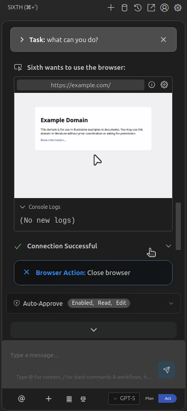

When you use **Sixth**, you get a two-phase workflow and editor-native helpers:

* **Plan & Act modes**

  * **Plan**

    > Sixth reads your codebase, asks clarifying questions, and helps design an approach without touching files. It’s meant for scoping, exploring structure, and de-risking changes.

  * **Act**

    > Once you’re happy with the plan, Sixth can implement it, making edits across files while keeping the planning context. You approve changes as it go.

* **Editor integrations**

  * **Inline/CodeLens actions & code commands** for explanations, fixes, and refactors directly in the file.
  * **Terminal helper (“See Terminal”)** to generate shell commands from natural language.
  * **Project-aware chat & codebase indexing** so the agent can navigate and modify multiple files in one flow.

Under the hood, Sixth can **read/write files, run commands, use a browser tool, and extend itself via MCP servers**, which all require explicit approvals unless you enable auto-approve.

#### Pricing

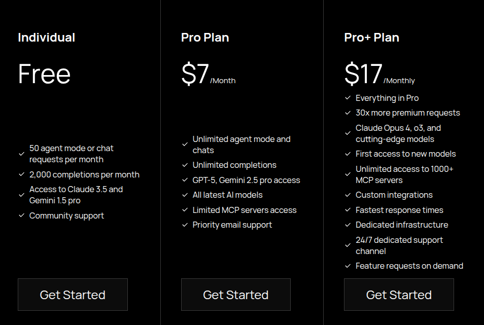

Sixth has a free tier with limits, and if you want to take advantage of MCP servers and agentic functionality regularly, Sixth offers paid plans, starting at $10/month.

Neither the free or paid tiers of Sixth require you to have your own API keys for the models you want to use.

#### Voice Support

At the moment, Sixth doesn’t support voice input and all interaction is via chat, inline edits, and commands in VS Code.

#### Context Window

Sixth actively builds context in two ways: automatic file exploration and user-guided context.

Additionally, it shows a context progress bar so you can see how many tokens could still be processed before reaching the context window's limit.

#### MCP / Tools

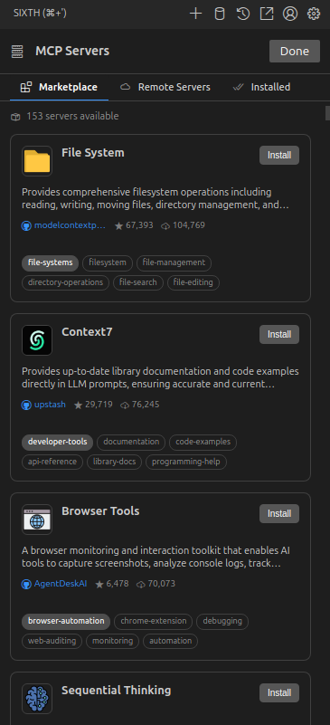

Sixth allows you to use MCP servers from their marketplace or by adding your own custom remote server, to extend the capabilities of Sixth.

#### Privacy & Security

Relevant links:
https://docs.trysixth.com/more-info/telemetry
https://docs.trysixth.com/enterprise-solutions/security-concerns#data-privacy-commitment

Sixth hasn't have published a privacy policy or terms of service on their homepage, which is a major oversight given that it would be the bare minimum for these kinds of products. The closest documents I could find related to how data is handled was about how the use telemetry data and a security concerns page.

Based on those documents, Sixth discloses that the VS Code extension has no server-side components and it connects directly to your chosen AI endpoints. They also have a zero-data-retention policy for code, so code and responses aren’t collected.

Another point that stands out is their claim about Sixth being open-source, which it is not available on their official GitHub profile and seems odd since there's no evidence in the document to verify that claim. If you know of a different repository where they are hosting their code, please let me know.

#### Conclusion

Sixth provides multiple features within one extension, like code completion, agentic actions like browser navigation, multiple-file changes and MCP actions. You can ask questions about your codebase, generate documentation, and also execute shell commands using the terminal.

I believe that Sixth is a young startup, and I understand they still need to polish the product, but the lack of clear privacy policies, terms of service and transparency disclaimers makes me a bit worried about the legitimacy of this extension.

I hope I'm being paranoid and it's all good, but we'll see.

That said, I think Sixth has a lot of potential and I believe that it's worth giving it a try if you are looking for a solution that could give you access to multiple AI models, without the need to manage API keys or individual payments to each AI provider you want to use.

***

### Code Web Chat (CWC) - ChatGPT in Your VS Code

Official site:
https://codeweb.chat/

VS Code Marketplace listing:
https://marketplace.visualstudio.com/items?itemName=robertpiosik.gemini-coder

GitHub:
https://github.com/robertpiosik/CodeWebChat

Code Web Chat is a free, open-source VS Code extension that connects your editor to AI chatbots in your web browser, which acts as a bridge between VS Code and all those web AI chat interfaces (ChatGPT, Claude, Bard/Gemini, etc.).

Instead of copying code to ChatGPT and back, CWC lets you do it in one flow:
- You select files or code in VS Code
- Type an instruction (like “Optimize this function” or “Explain this code”),
- And it will automatically open your browser and initialize a chat with the AI of your choice, pre-loaded with the selected code and prompt
- When the AI responds in the browser, CWC adds an “Apply” button so you can insert the answer back into your code with one click

*Source:https://codeweb.chat/*

To use CWC, you need to install the VS Code extension and then install the browser extension, because as I mentioned above, your prompt and context will be sent to the chatbot you choose to use. For example, you can use regular ChatGPT (free or Plus version) or other free chatbots via their web interfaces, without API keys or payments to the AI provider needed. Essentially, if there’s a web-based AI that can help with coding, CWC likely supports it.
ed AI models

#### Supported AI models

CWC supports some of the most popular chatbots and interacts with them via their web interface. This is the full list:

- AI Studio
- ChatGPT
- Claude
- DeepSeek
- Doubao
- Gemini
- Grok
- Kimi
- Mistral
- Open WebUI
- OpenRouter Chat
- Perplexity
- Qwen
- Together
- Yuanbao
- Z.AI

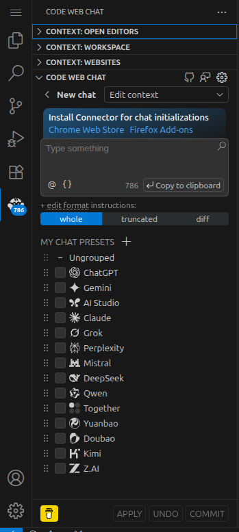

#### Features

By installing the companion browser extension ([Chrome](https://chromewebstore.google.com/detail/code-web-chat-connector/ljookipcanaglfaocjbgdicfbdhhjffp) and [Firefox](https://addons.mozilla.org/en-US/firefox/addon/code-web-chat-connector/)), CWC can launch these chats and inject your prompt and context hands-free. The extension doesn’t store the AI’s input or output, and you can review the answers before explicitly clicking “Apply” to paste the AI's response inside your code editor.

Besides the browser chats, CWC also includes some basic API-based tools: you can configure an OpenAI-compatible API key (OpenAI, Azure, or local OAI-like APIs) to get inline code completions or run edits within VS Code. So it offers both real-time completions (like Copilot style) and the multi-file chat workflow.

#### Pricing

Code Web Chat is MIT-licensed open source software and doesn’t charge anything. It’s a community-driven “free forever” project. The only costs would be optional: e.g. if you use an API that charges money (OpenAI API usage) or if you decide to donate to the developer. Otherwise, by using the free web UIs of AI models, you avoid paying.

#### Voice Support

There’s no voice control in CWC, it’s all text-based. However, since it works with browser chat UIs, you could technically use something like Chrome’s voice typing or a browser extension for voice if you really wanted to dictate, but natively, CWC doesn’t handle voice commands.

#### Context Window

CWC’s workflow allows a multi-file context. You can select multiple files or sections in VS Code and send them together to an AI chat prompt. The limitation is whatever the target AI’s context size is (ChatGPT has its token limit, Claude has its larger context, etc.). There’s no fancy vector database or code indexing here, it’s a funnel to the AI's UI chat interface.

#### MCP / Tools

This extension doesn’t integrate with MCPs or tool use, because its philosophy is to keep things local and simple. It doesn’t run external commands and it just hands off to web AIs and brings back the results.

#### Privacy & Security

Relevant links:
https://codeweb.chat/privacy

CWC claims that it doesn't collect telemetry or stash your code. The code you select is sent to the AI in your web browser, just as if you pasted it yourself. Since it’s open source, you can inspect their claims.

#### Conclusion

In a nutshell, Code Web Chat turns your browser into a sidekick for VS Code. It’s lightweight and focused, with no complex features to configure. You do need to install a browser plugin and keep a browser open.

I think this tool is best suited for devs who want to save money and don't need complex features. It's not as streamlined as other extensions explored here, but it gets the job done for simple tasks.

***

### Syntx - Autonomous AI Agent in Your Editor

Official site:
https://syntx.dev/

VS Code Marketplace listing:
https://marketplace.visualstudio.com/items?itemName=OrangecatTechPvtLtd.syntx

GitHub:
https://github.com/OrangeCat-Technologies/SyntX

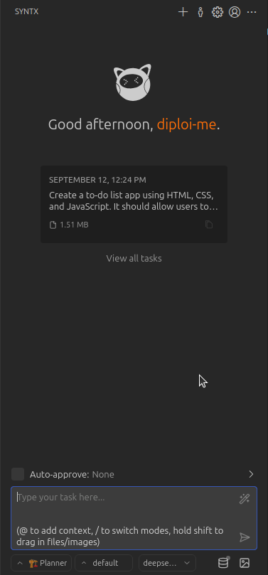

Syntx is an AI autonomous coding agent that works in VS Code, which started as a fork of the popular Roo-Code AI coding extension. It can read and write files in your project, run terminal commands, automate browser tasks, and integrate with popular AI models and custom models.
models

https://www.youtube.com/watch?v=sY1AOOywlxQ

#### Supported AI models

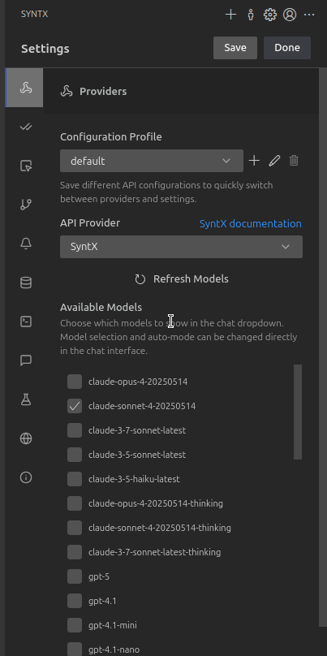

Syntx allows multiple AI API providers, so you can access different proprietary models, either by adding your own API keys or through Syntx. Additionally, it allows you also use your own AI models, using LM Studio or Ollama.

The complete list of API providers includes:

- Amazon Bedrock
- Anthropic
- Chutes AI
- Claude Code
- DeepSeek
- GCP Vertex AI
- Glama
- Google Gemini
- Groq
- Human Relay
- LiteLLM
- LM Studio
- Mistral
- Ollama
- OpenAI
- OpenAI Compatible
- OpenRouter
- Requesty
- SyntX
- Unbound
- VS Code LM API
- xAI (Grok)

If you use Syntx as your default provider, you can use the following models:

* claude-opus-4-20250514
* claude-sonnet-4-20250514
* claude-3-7-sonnet-latest
* claude-3-5-sonnet-latest
* claude-3-5-haiku-latest
* claude-opus-4-20250514-thinking
* claude-sonnet-4-20250514-thinking
* claude-3-7-sonnet-latest-thinking
* gpt-5
* gpt-4.1
* gpt-4.1-mini
* gpt-4.1-nano
* o3-mini
* o4-mini
* llama-3.3-70b-versatile
* meta-llama/llama-4-scout-17b-16e-instruct
* qwen-qwq-32b
* deepseek-r1-distill-llama-70b
* Kimi-K2
* perplexity-sonar-pro
* perplexity-sonar
* perplexity-sonar-premium
* perplexity-r1-1776
* perplexity-sonar-reasoning-pro
* perplexity-sonar-reasoning
* gemini-2.5-flash
* gemini-2.5-pro
* gemini-2.5-flash-thinking
* gemini-2.5-pro-thinking
* deepseek-v3
* deepseek-v3-premium
* Grok-4
* openrouter-deepseek-r1
* openrouter-claude-sonnet-4
* openrouter-gemini-2.5-pro
* openrouter-codestral-2501
* openrouter-magistral-medium-thinking
* openrouter-devstral-small
* GLM-4.5
* qwen3-coder
* gpt-oss

#### Features

When you use Syntx, you’re not limited to one mode of operation. It provides multiple “Modes” or personas you can switch between depending on what you need. The available modes are:

- Plan
    > Intended to first prepare the assistant, based on your app's context, and it prepares the actions that the agent must follow

- Code
    > Allows for code editing and generation inside your files

- Chat
    > Which lets you make questions about your code

- Debug
    > Used for code reviewing and fixing issues
    
- Orchestrator
    > Which can be used to combine the other modes to execute complex operations

Additionally, it allows you to create custom modes, so you could, for example, create a mode to generate documentation or security audits. The use of modes gives Syntx the possibility to adapt its style and the tools it uses based on context.

#### Pricing

Syntx's extension is free to use if you use an API provider, and you only pay for the credits you consume through those providers or infrastructure costs if you host your own modes.

Syntx, as an API provider, allows some free usage, but there's no free tier and doesn't have a trial to explore all features in-depth, which might be limiting if you want to test Syntx as your API provider without paying for an extended period of time. If you choose to use Syntx as your default provider, they charge $1 per credit plus a 15% platform fee + 3.37% processing fee, which amounts to $1.19 per credit.

#### Voice Support

At the moment, Syntx doesn't have voice capabilities and it only operates through the chat interface and command palette. You type commands/instructions and the AI executes them.

#### Context Window

Syntx can read multiple files, it can open and inspect parts of your project as needed, but it doesn't index all files in your project proactively.

#### MCP / Tools

Syntx also has agentic capabilities via MCP servers and it can perform actions inside of your code on demand. Some actions include:

- Create, modify, or delete any file in your workspace files.
- Run shell commands in the VS Code terminal, so it can run your build, or git commands, etc., on request.
- Control a browser and automate actions to fetch info or run a web-based tool.
- Use external MCP tools, allowing you to plug in community or custom tools.

MCP support means you could, for example, add a tool that calls an API or queries documentation, and Syntx’s AI could invoke that as part of solving a task. Syntx will execute commands only with your permission at each step.

#### Privacy & Security

Relevant links:
https://syntx.dev/policy

Because Syntx allows you to bring your own model and it’s open-source, you can use AI in your codebase, sending all data only to the AI provider you prefer. Although if you use Syntx as your API provider, it means that your code will be exposed to Syntx as well.

One important security aspect is that because Syntx can run commands and edit files, you should only use it in directories and with projects where you’re okay with those kind of operations. By default, Syntx will always ask for confirmation before performing an action.

#### Conclusion

Syntx offers code assistant capabilities, with a wide range of options and behaviours that allow for a lot of flexibility, for example, it figures out a plan and executes step by step, while confirming with you to make sure that it is only executing changes that you agree with.

If you want to evaluate different models in your code or use different models for various tasks within your code, then Syntx will be an interesting option for you. 

***

### Tabby - Self-Hosted Copilot Alternative

Official site:
https://www.tabbyml.com/

VS Code Marketplace listing:
https://marketplace.visualstudio.com/items?itemName=TabbyML.vscode-tabby

GitHub:
https://github.com/TabbyML/tabby

Tabby is an open-source, self-hosted AI coding assistant that provides code completions and a chat helper, much like GitHub Copilot, but you run it on your own machine or server.

With Tabby, you must install the Tabby extension and also run the Tabby AI local server. The server hosts the actual AI models that generate code suggestions. The VS Code extension then communicates with this server to get completions or to answer questions. This architecture means your code and prompts stay within your environment.

#### Supported AI models

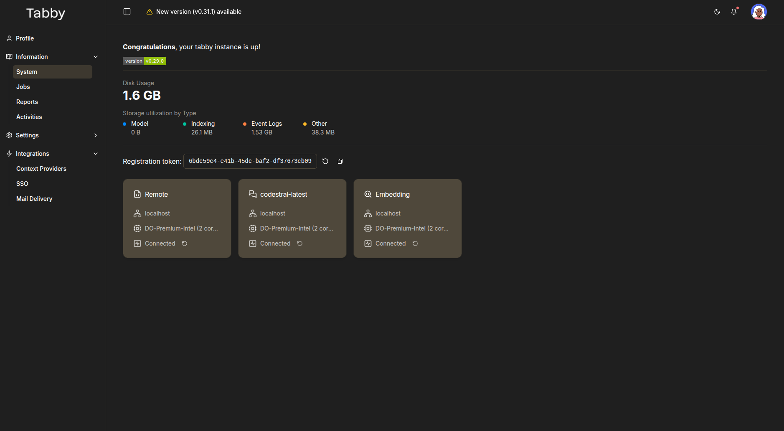

Tabby doesn’t come with a single huge pretrained model like GPT-4 (that wouldn’t be open source or lightweight). Instead, Tabby supports various open-source LLMs for code. You can choose from models like StarCoder, CodeLlama, Qwen, among other options that the Tabby team has integrated.

They provide a Model Registry listing open source models that they support and they can be used for three different purposes:

##### Completion models

- StarCoder-1B
- StarCoder-3B
- StarCoder-7B
- StarCoder2-3B
- StarCoder2-7B
- CodeLlama-7B 
- CodeLlama-13B 
- DeepSeekCoder-1.3B 
- DeepSeekCoder-6.7B 
- CodeGemma-2B 
- CodeGemma-7B 
- CodeQwen-7B 
- Qwen2.5-Coder-0.5B 
- Qwen2.5-Coder-1.5B 
- Qwen2.5-Coder-3B 
- Qwen2.5-Coder-7B 
- Qwen2.5-Coder-14B 
- Codestral-22B 
- DeepSeek-Coder-V2-Lite 

##### Chat models

- Mistral-7B 
- CodeGemma-7B-Instruct 
- CodeQwen-7B-Chat 
- Qwen2.5-Coder-0.5B-Instruct 
- Qwen2.5-Coder-1.5B-Instruct 
- Qwen2.5-Coder-7B-Instruct 
- Qwen2.5-Coder-14B-Instruct 
- Qwen2.5-Coder-32B-Instruct 
- Qwen2-1.5B-Instruct 
- Qwen3-0.6B 
- Qwen3-1.7B 
- Qwen3-4B
- Qwen3-8B
- Qwen3-14B
- Qwen3-32B
- Qwen3-30B-A3B
- Qwen3-235B-A22B
- Codestral-22B
- Yi-Coder-9B-Chat	

##### Embedding models

- Nomic-Embed-Text
- Jina-Embeddings-V2-Code

You can also specify your own model by following the [Tabby Model Specification](https://github.com/TabbyML/tabby/blob/main/MODEL_SPEC.md).

#### Features

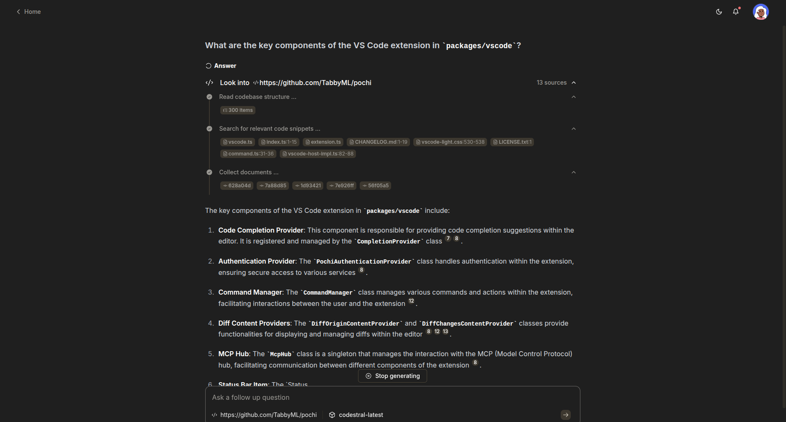

Tabby’s primary feature is autocomplete, so as you type, it suggests the code you need, including multi-line suggestions and whole function bodies in real-time.

It also has a chat Q&A component, where you can ask questions about your code (e.g. “What does this function do?” or “How can I optimize this query?”) and it will answer, citing context from your code.

There’s also an inline chat feature to give commands to modify selected code or generate via prompt (similar to Copilot’s “edit” functionality).

Tabby also has a code browser, which allows you to explore files from your indexed repositories.

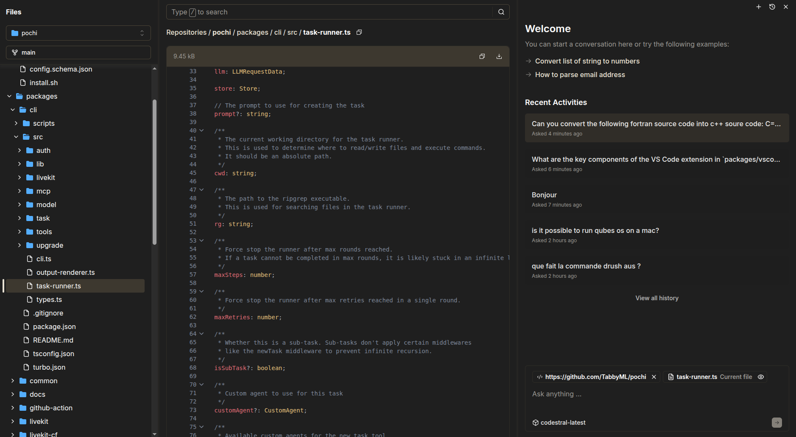

#### Pricing

Tabby is free, but if you're working with a team with more than 5 users, then you need to buy a subscription. The base subscription costs $19/month per user, so for a team of 6, it would be $114/month.

Tabby doesn't charge you for inference, since you must handle the hosting for your AI models, so all compute costs would come from the hardware you use, rather than from Tabby.

#### Voice Support

Tabby doesn't have support for voice commands.

#### Context Window

Tabby can index git repositories from GitHub, GitLab and docs, but it doesn't index your local code. For chats, you can feed specific files within your code and docs, to tailor responses based on context.

#### MCP / Tools

It doesn't support MCP servers or agentic behaviours.

#### Privacy & Security

Relevant links:
https://www.tabbyml.com/terms
https://www.tabbyml.com/privacy

With Tabby, you must use self-hosted models, so your code doesn't leave your local environment. One point to note is that Tabby collects telemetry data on all self-hosted instances, which they claim is only used internally at Tabby.

#### Conclusion

In short, Tabby is the “roll your own” solution. It’s meant for those who value privacy and control over convenience. You might not get OpenAI-level IQ, but it won’t surprise you with large bills. For small projects or learning purposes, using Tabby can also teach you how AI code assistants work under the hood.

It's not the most plug-and-play tool out there, but if you are looking for a fully self-hosted solution, then Tabby is for you.

***

### Augment Code - The Professional’s AI Copilot with Superpowers

Official site:
https://www.augmentcode.com/

VS Code Marketplace listing:
https://marketplace.visualstudio.com/items?itemName=augment.vscode-augment

GitHub:
https://github.com/augmentcode

Augment is an AI coding extension can handle context indexing. Based on feedback from their community, it seems they have a better context engine than other popular tools like Cursor and Windsurf, although I couldn't validate how true that is.

#### Supported AI models

The models available within Augment depend on the mode you need to use. If you use the Chat mode, then Augment uses its own model and it doesn't have support for external models. When instead, you are using the agent mode (local or remote), then you can choose between **Claude Sonnet 4** or **OpenAI GPT-5**.

#### Features

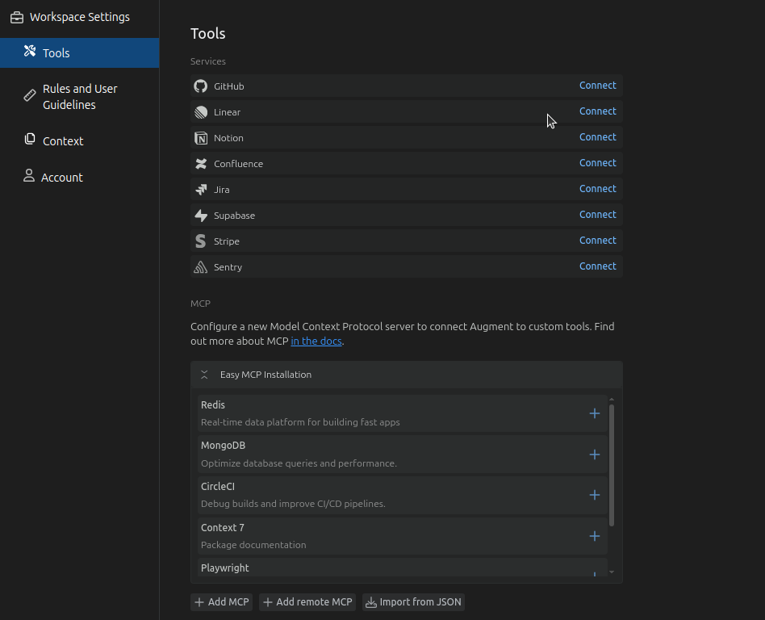

Augment has multiple interesting features, with one of its core features being its Context Engine, which indexes your codebase to generate suggestions and chat responses that are context-aware across your project.

Other features include:

- **Agent mode:** An AI agent that can complete high-level tasks like “Add a new API endpoint for X” by planning and making multiple edits across files. It’s aware of your frameworks, dependencies, schemas, etc.

- **Remote agent mode:** This mode uses the same agent as the local mode, but instead of running the agent locally, it runs it remotely, so you can use it in any environment.

- **MCP servers:** Augment supports 100+ MCP tools and native integrations to expand what the agent can do. It ranges from database lookups to calling an external API during its reasoning.

- **Chat with Smart Apply:** The chat interface allows for Q&A with your codebase, but additionally, when it gives you an answer or code change, you can apply the suggested changes from the chat interface.

- **Next Edit:** This feature is a guided workflow for multi-step code changes, for example, if renaming a function might require updating references, docs, tests, the workflow walks you through each update required.

- **Inline Instructions & Completions:** You can use natural language to modify code directly inside your files, similar to how GitHub Copilot works. It can also do autocompletions as you type, which are based on the overall context of your project, rather than standalone suggestions.

#### Pricing

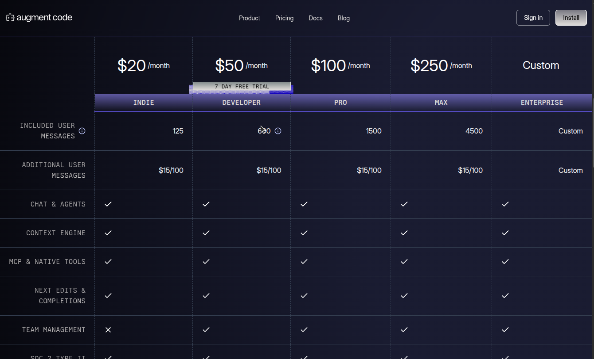

Augment Code is a closed-source, fully paid service, with a 7-day trial, which gives you code completions and Next Edit, and if you add a payment method, you get 50 chat messages free.

They have 4 different pricing tiers and a custom plan for larger companies. Their prices start at $20/month.

To get serious usage, you’d move to the Developer plan at $50/month, which gives you 600 messages/month and additional features like team collaboration and SOC2-grade security. They also have Pro $100/month for 1500 chat messages and Max $250/month for 4500 chat messages for higher volume.

Completions and Next Edits are unlimited for all plans, while the message limits apply to chat/agent interactions. Regardless of your plan, if you exceed your message limit, Augment offers extra message packs of 100 messages for $15.

#### Voice Support

Augment doesn't have voice control. It’s all text-based through their chat interface and code completions.

#### Context Window

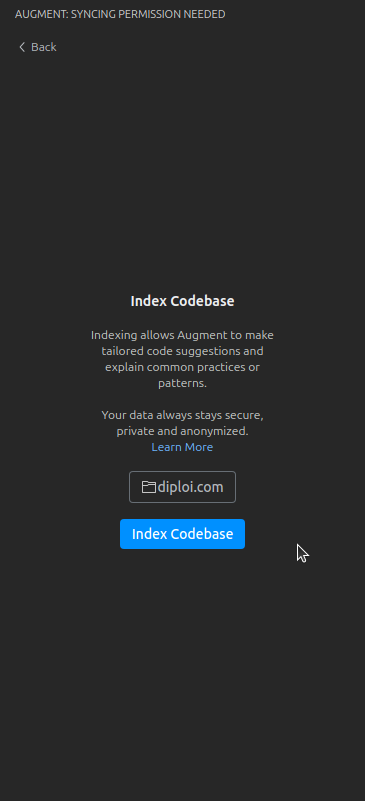

Augment indexes your project folder, so the Context Engine can retrieve the most relevant pieces into the model, to keep code completions and chat constrained and cost-effective. If you have a multi-folder project, you can extend a project's context by linking to other folders containing relevant code for your project.

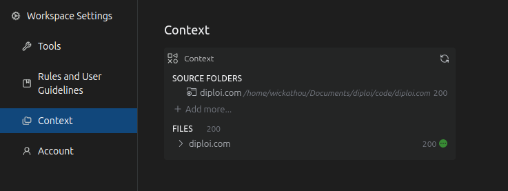

Beyond local files, Augment’s context can be extended with its tools and MCP servers. One example is the integration with GitHub, which can feed recent Git commit history so the Augment agent can reuse it to understand patterns and answer questions linked to previous changes, extending context beyond the current state of the code in your project.

#### MCP / Tools

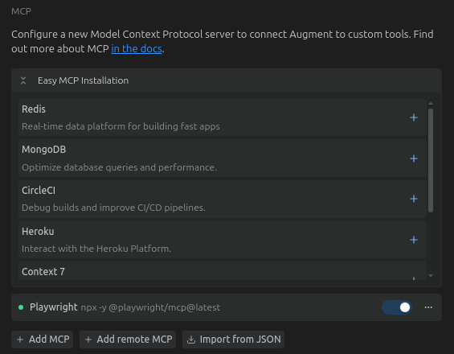

Augment supports MCP servers so the Agent mode can use external tools and data sources, with one-click integrations for popular dev services like CircleCI, MongoDB, Redis, Honeycomb, Heroku, Render, and Vercel.

You can also configure additional servers manually or import JSON configs. For control, Augment exposes tool permissions so you decide what the agent can do (e.g., running commands, editing files, calling integrations).

#### Privacy & Security

Relevant links:
https://www.augmentcode.com/legal/privacy-policy
https://www.augmentcode.com/legal/community-terms-of-service
https://www.augmentcode.com/legal/professional-terms-of-service
https://www.augmentcode.com/legal/enterprise-terms-of-service

Augment claims that it doesn't train its AI with your data, and all users get SOC 2 Type II compliance by default.

Now, something confusing is that depending on what service tier you are using, their terms of service are different. For users on the Community tier, who are people using Augment code for free, the user's code and the responses generated are used for training, while the Professional and Enterprise tiers are not used for code.

I suspect that the Community tier is no longer available, but some users might still have access to it, which is why they still list the Community terms.

#### Conclusion

Augment positions itself as an agentic coding platform for large codebases, where you pay per user message, while “Next Edits” & completions are unlimited. Their Context Engine pulls the code, docs, and commit history into its responses, which adds an extra layer of accuracy.

Additionally, their MCP support and integrations with other dev tools make it easy to wire build systems, databases, and deployment platforms to extend Augment's capabilities beyond just coding.

If you work with large codebases and need code completions and agentic capabilities with context awareness, then Augment is an interesting alternative for you to explore.

***

### GoCodeo - Build & Ship Apps with an AI Agent

Official site:
https://www.gocodeo.com/

VS Code Marketplace listing:
https://marketplace.visualstudio.com/items?itemName=GoCodeo.gocodeo

GitHub:
https://github.com/gocodeo/

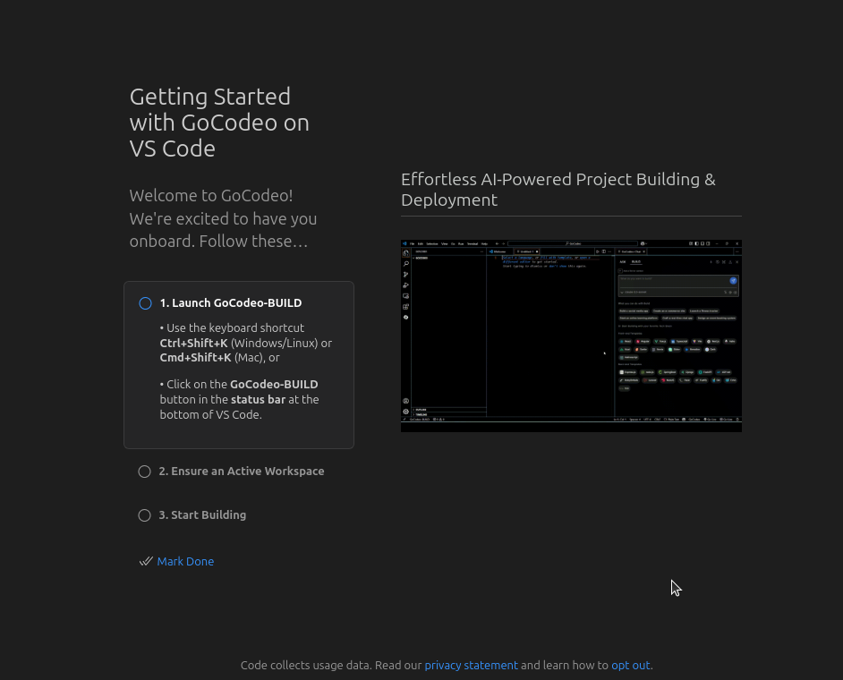

**GoCodeo** is an AI coding agent that lives inside VS Code and helps you **ask**, **build**, and **test**, from scaffolding full-stack apps to one-click deploys. It ships with workflow models for **ASK**, **BUILD** and **TEST**. It also supports **MCP** to wire up tools like GitHub, Notion, Postgres, and Stripe, for example, so agents can fetch external context and perform multi-step actions.

https://www.youtube.com/watch?v=3dNLxoinblU

#### Supported AI models

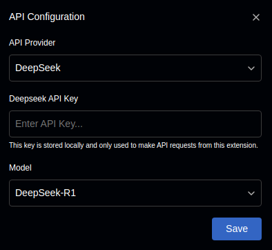

GoCodeo lets you pick models via a **Model Selector**, listing 4 providers and specific options that include:

- Anthropic
    - Claude 3.5 Sonnet
    - Claude 4 Sonnet
- OpenAI
    - GPT-4.1
    - o4-Mini
    - GPT-4o Mini
- Google
    - Gemini-2.5-Pro
- DeepSeek
    - DeepSeek-R1
    - DeepSeek-V3

In GoCodeo, you need to bring your own API key for each provider you wish to use.

#### Features

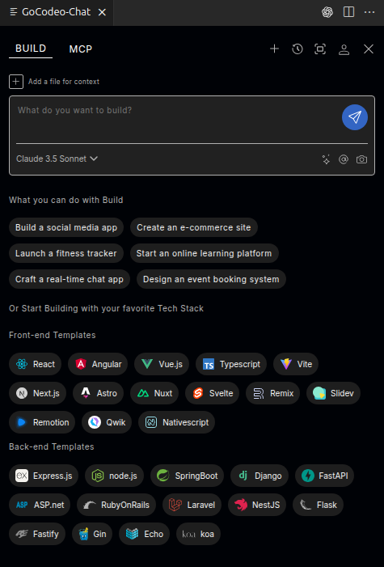

GoCodeo's features cover a wide range of tasks, from general Q&A to full-stack app development. Here's the full list of features:

- Different modes for specific tasks within your code, which include:
    - **ASK**

        This allows you to chat with the agent to **ask over documents and images**, use a **Terminal Helper** for command suggestions and a **Terminal Debugger** for failed commands, and keep an organized **chat history**. There’s also an **Enhance Prompt** helper that expands simple asks into richer specs.

        To access the ASK mode, you can use the shortcut: **Ctrl/Cmd + Shift + L**

    - **BUILD**
    
        Which is all about **scaffolding front-end and back-end codebases**, with the following frameworks:

        - **Front-end Templates**
            - React
            - Angular
            - Vue.js
            - Typescript
            - Vite
            - Next.js
            - Astro
            - Nuxt
            - Svelte
            - Remix
            - Slidev
            - Remotion
            - Qwik
            - Nativescript

        - **Back-end Templates**

            - Express.js
            - node.js
            - SpringBoot
            - Django
            - FastAPI
            - ASP.net
            - Ruby on Rails
            - Laravel
            - NestJS
            - Flask
            - Fastify
            - Gin
            - Echo
            - koa

        You can also use a visual **scaffolding** panel, **dependency management**, **build history**, and **one-click deploy** to Vercel. It also supports **Supabase** for auth/data. You can attach an **image to generate code**, and use **@ references** to target files/symbols. 
        
        The BUILD mode shortcut is: **Ctrl/Cmd + Shift + K**

    - **TEST**

    Used to generate unit tests in multiple languages, and execute them with a built-in runner (e.g., Python/JS/Java/Go). You get **AI debugging insights**, and can apply **auto-fixes** when reviewing the results.

- GoCodeo supports MCP servers, which can be declared in a `mcp.json` file, and allows you to add **Global MCP servers**, browse **community MCP servers**, and let the agent **auto-select** tools per request. You get **inline logs & reasoning** for each tool call.

- **Context handling** by using **@Files** and **@Code** to reference file paths or specific code sections, plus the option to attach **documents/images** as context to generate answers.

- **WebSearch (@Web)** powered by Perplexity, to find relevant documentation.

- **Auto-generate README files** by analyzing repository contents

- **GitHub pull-request assistance** to create and manage pull request, with reference generation.

#### Pricing

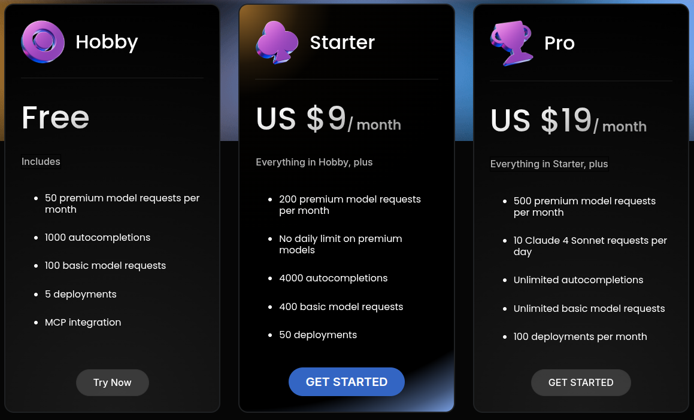

There are **two stories** depending on where you look:

- On the **VS Code Marketplace**, GoCodeo’s FAQ says it’s **“now completely free because you bring your own API keys”**, with no per-token charges, and you control provider costs.

- On GoCodeo’s **website pricing page**, there are tiers:
    - **Hobby (Free)** with quotas for premium model requests, autocompletions, and deployments
    - **Starter ($9/month)** and **Pro ($19/month)**, with higher limits, including daily Claude Sonnet allowances.

In practice, this suggests two pricing models, one free where you **bring your own API keys**, and the other, which is paid, where you access the models via **GoCodeo-metered usage**, if you want built-in usage without managing keys.

Although to me it seems odd that there are limits on the free tier, if you have to bring your own API key, I suppose it could be due to the costs generated from handling the requests that the extension has to perform.

#### Voice Support

GoCodeo doesn’t have built-in microphone/voice control in the VS Code extension. Interaction is all text-based for all ASK/BUILD/TEST modes.

#### Context Window

GoCodeo treats “context” as what you attach or reference, then streams only the relevant pieces to the model you pick:

- @Files to reference files.

- @Code to reference exact code snippets.

- Document and image attachments (PDF/DOC, UI mocks) as additional context.

#### MCP / Tools

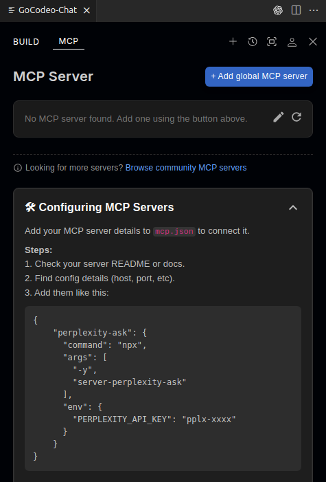

MCP servers must be manually set up in GoCodeo, which can be defined in an `mcp.json` file, and allows you to add **Global MCP servers**. The user experience is not as smooth as other AI extensions we explored so far.

There are no additional integrations to other services inside GoCodeo.

#### Privacy & Security

Relevant links:
https://www.gocodeo.com/terms-of-use

GoCodeo doesn't have standalone pages for terms of service or privacy policy on its homepage and instead has a "Terms of Use" page, which covers some points, but in a very short and generic way.

They claim that your usage data might be used to improve their services, and that customer data is never shared or sold, but they don't specify what they classify as usage data or customer data, or if your code is used for training.

#### Conclusion

GoCodeo seems ok to explore if you are comfortable with the lack of transparency around their data policies. Maybe they are just a young startup and they will improve their policies as they grow.

Their lack of consistency around pricing is also odd, and it's not clear if the limits apply as a trial or if they apply even if you add your own API keys.

If you are an individual developer who likes to test out different tools, then GoCodeo might be a good option for you to explore. However, if you work at a company that has strict rules around data privacy, then I would avoid using this extension.

***

### Vibe Coder - Voice-Driven Coding with AI

Official site:
https://deepgram.com/

VS Code Marketplace listing:
https://marketplace.visualstudio.com/items?itemName=Deepgram.vibe-coder

GitHub:
https://github.com/deepgram/vibe_coder

Vibe Coder is a different flavor of AI coding assistant. Vibe Coder is a voice-first coding assistant by Deepgram, a company focused on voice assist. This extension lets you interact with VS Code and generate code using natural voice commands. 

**Important**
Vibe Coder seems to be in a very early stage and hasn't been updated in a while, which might explain why, while I was trying it, I couldn't get the Vibe mode to work, so I can't speak about its capabilities for vibe coding. The Code mode worked fine, and I'll try it out in my workflow when writing blogs.

#### Supported AI models

Vibe Coder uses their own model for voice-to-text, and then they use OpenAI for the AI response generation, although from their documentation, it's not clear what model they use, but from their repository, you can see that they use `gpt-4-turbo-preview`, and during testing it showed on my usage dashboard as **gpt-4-0125-preview**, which is the right model ID. I couldn't find a way to change the model from the extension settings, but in theory, it should be possible by using the source code to self-host the extension.

#### Features

Since I couldn't test the Vibe mode, I can only speak about the Code mode with certainty, but I'll list other features that I found in the documentation and marketplace listing for Vibe Coder, and will separate them into two main categories, verified and unverified:

##### Verified features

- Code mode (dictation and voice-to-text chat): Speak code/instructions, the extension sends your transcript to the DeepGram API for transcription, and then using customizable prompts (e.g., “debug this,” “fix typos,” “make it idiomatic <lang>”), uses OpenAI to generate the response, and copies the result to your clipboard.

- Cross-platform mic support: Uses SoX (macOS/Windows) or ALSA tools (Linux) for audio capture; includes commands to test and list microphones and per-OS device settings.

##### Unverified features

- Vibe mode (voice agent): Brainstorm ideas, validate approaches, and even ask it to generate a product spec at the end of the conversation or code snippets. As I mentioned before, I couldn't get this mode to work, so I can't speak about its capabilities.

- Voice commands & navigation: Sample commands include “open the file index.js,” “create a new file,” “show explorer,” “tell me about this codebase.”

Besides these features, DeepGram claims in the Vibe Coder marketplace listing to be working on other future improvements like adding project context and MCP capabilities, but the last update of their extension was in February 2025, so I'm not sure if they are still actively working on it.

#### Pricing

Vibe Coder is free to use, but you need to provide your own API keys for DeepGram and OpenAI. There are no additional costs associated with using the extension.

#### Voice Support

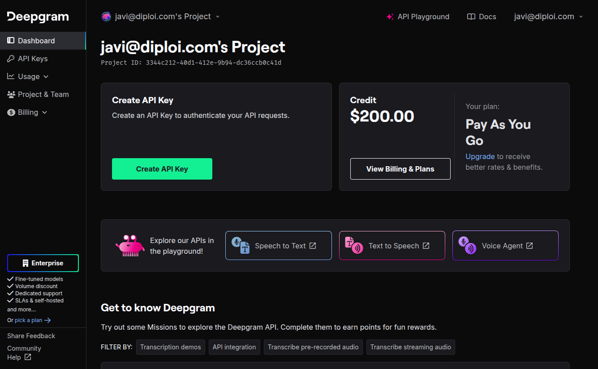

Vibe-Coder is voice-first, all you need to do is open the Vibe Coder panel with `Cmd/Ctrl + Shift + V`, select the model you want to use, and start/stop dictation with `Cmd/Ctrl + Shift + D`. You can't continuously talk to the agent, you need to stop and start the dictation to send the prompt to OpenAI to get a response.

The extension includes cross-platform mic support and requires system audio tools (SoX on macOS/Windows, ALSA utilities on Linux) for capture.

#### Context Window

Vibe-Coder doesn't have a way to index projects, which is odd since the Vibe mode would require a way to understand the context of the project to be useful.

#### MCP / Tools

There’s no MCP support yet. The public roadmap calls out “Add MCP capability to the Vibe mode agent,” indicating tool-calling via MCP is a future enhancement rather than a current feature.

#### Privacy & Security

Relevant links:
https://deepgram.com/privacy

The extension is open-source, so you can check their code, while the audio is sent to Deepgram for processing. The extension doesn't store audio itself and all conversations are handled under Deepgram’s privacy policy. From the repository of Vibe Coder, it seems that once the audio is processed, it is then sent to OpenAI.

DeepGram doesn't have a privacy policy or terms of service for Vibe Coder, so it's hard to know what they do with the audio and the conversations in the released extension.

#### Conclusion

Vibe Coder is an interesting initiative to explore voice-first coding, but as I mentioned, the fact that the product hasn't been updated in the past months makes me question if it's still actively maintained. 

If you want to experiment with voice coding, give Vibe Coder a try, although I couldn't get the Vibe mode to work on my machine. 🥲

***

## Comparing the Extensions

In summary, let's compare all extensions:

### Pricing

| Extension     | Plans                                                                                          |
| ------------- | ---------------------------------------------------------------------------------------------- |
| Sixth AI      | Free with limits and paid from $10/month or $7/month if you take the annual plans.             |
| Code Web Chat | Free and also open source                                                                      |
| Syntx         | Free if you bring your own API keys or paid if you use Syntx credits to access AI models, for $1 per credit + 15% platform fee + 3.37% Razorpay fee |
| Tabby         | Self-hosted models only, Free for up to 5 users, paid for teams $19/user/month up to 50 users and custom pricing for Enterprise |
| Augment Code  | No free plans, Entry tier $20/month, Developer $50/month, Pro $100/month, Max $250/month and Enterprise custom pricing |
| GoCodeo       | Free with limits or fully free if you bring your own API keys, paid plans Starter $9/month or $85/year, and Pro $19/month or $182/year |
| Vibe Coder    | Free to use, but you must bring your own API keys for Deepgram and OpenAI                       |

### Code base indexing and context window

| Extension     | Summary                                                                                             |
| ------------- | --------------------------------------------------------------------------------------------------- |
| Sixth AI      | Project indexing with automatic file exploration and user-guided context                            |
| Code Web Chat | No indexing, sends selected code to the target web chatbot and it's limited by that model’s context |
| Syntx         | No indexing, but you can add files to your chat prompts                                             |
| Tabby         | No indexing, but you can add files to chat prompts                                                  |
| Augment Code  | Context Engine indexes the project folder and you can link additional folders                       |
| GoCodeo       | No indexing, but context can be added to prompts via @Files, @Code and attachments                  |
| Vibe Coder    | No indexing, but in Vibe mode, the assistant should, in theory, be able to read files                 |

### MCP, tools and integrations

| Extension     | Summary                                                                                                   |
| ------------- | --------------------------------------------------------------------------------------------------------- |
| Sixth AI      | MCP servers supported, can read/write files, run commands, use browser tool and terminal helper           |
| Code Web Chat | No MCP, browser connector to many chatbots                                                                |
| Syntx         | MCP servers supported, file edits, shell and browser automation with step approvals                       |
| Tabby         | No MCP, no browser tools or integrations                                                                  |
| Augment Code  | MCP servers supported with easy integrations like CircleCI, MongoDB, and others                           |
| GoCodeo       | MCP support via `mcp.json`                                                                                |
| Vibe Coder    | No MCP or other integrations                                                                              |

### Privacy and security

| Extension     | Summary                                                                                                                        |
| ------------- | ------------------------------------------------------------------------------------------------------------------------------ |
| Sixth AI      | Doesn't sell data, and doesn't use your code for training, closed source, routes requests via vendor servers, no published privacy policy or terms of service |
| Code Web Chat | Doesn't sell data, and doesn't use your code for training, open source, runs locally, sends code only to the chosen AI in your browser |
| Syntx         | Doesn't sell data, and doesn't use your code for training, open source, confirms before performing actions                             |
| Tabby         | Self-hosted, code stays in your environment                                                                                            |
| Augment Code  | Closed source, states no training on your data, although there's a Community plan where user data is used for training, SOC 2 Type II   |
| GoCodeo       | No dedicated privacy policy or terms on homepage noted in article, generic Terms of Use, usage data wording is unclear                 |
| Vibe Coder    | Open source, audio is sent to Deepgram for processing and then directed to OpenAI, covered by Deepgram privacy policy, there's no separate Vibe Coder privacy policy |

## Closing thoughts

So hopefully now I have given you some new tools to explore and maybe even to use in production, who knows.

I tried to make this post as neutral as possible, although, as you might have noticed, whenever I saw providers without clear privacy policies and terms of use, I tend to be negative about those providers, because it is important for me to know what happens with our data, especially for production.

If there's anything in this article that you disagree with or if you find any mistakes, please let me know, because it's important for me to know how I can improve my posts.

---

If you try any of these tools, please let me know how your experience was!

---

That's all for now, see you 😌

[Launch apps with a single click 👉](https://diploi.com/)✨

---

**References:**

https://trysixth.com/
https://codeweb.chat/
https://syntx.dev/
https://www.tabbyml.com/
http://augmentcode.com/
https://www.gocodeo.com/
https://github.com/deepgram/vibe_coder/tree/main/src