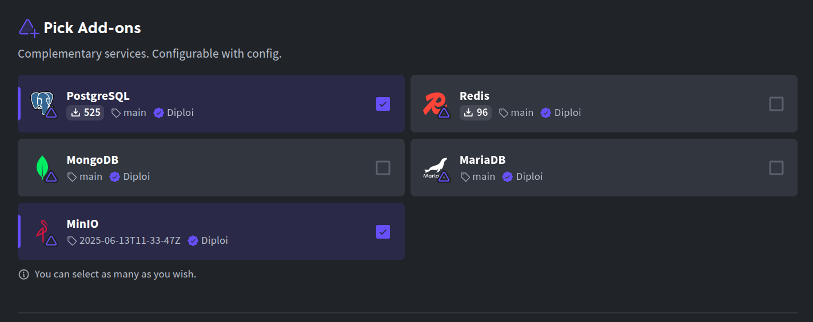
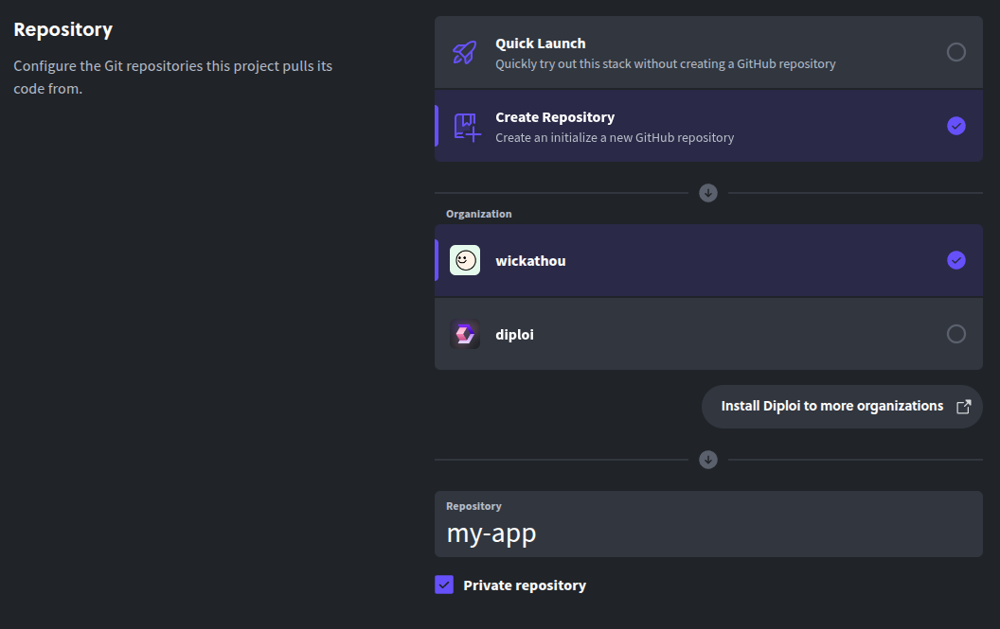
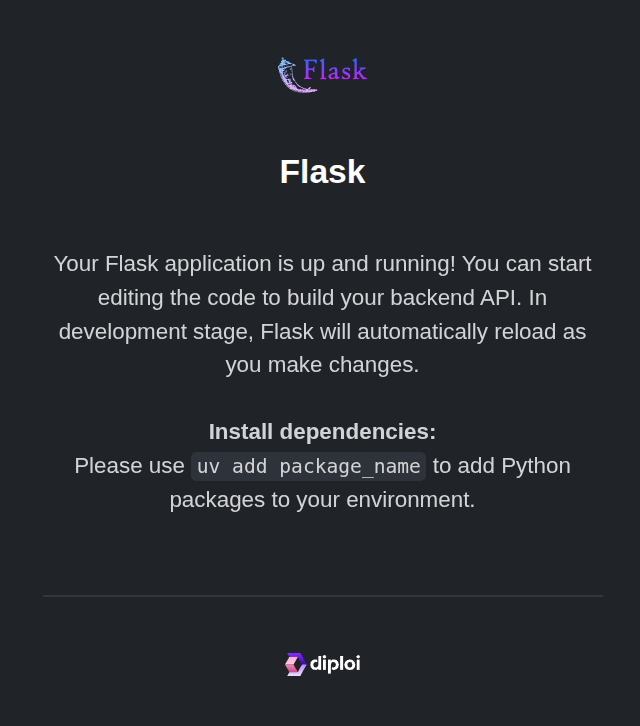
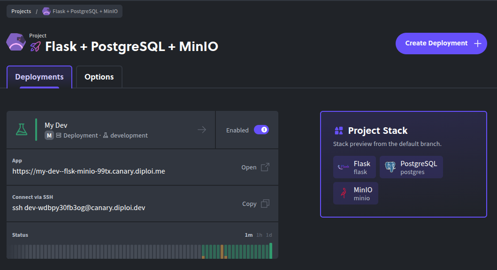
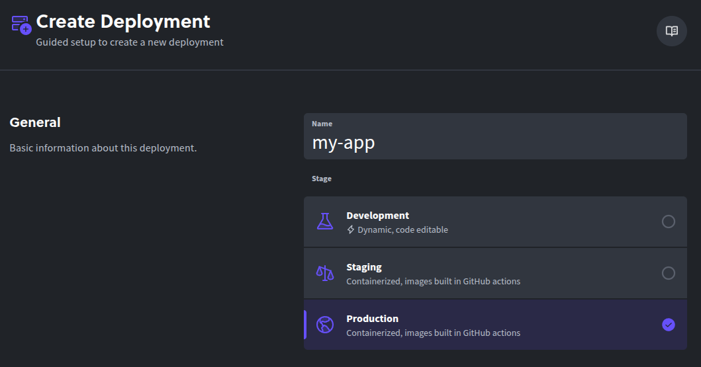
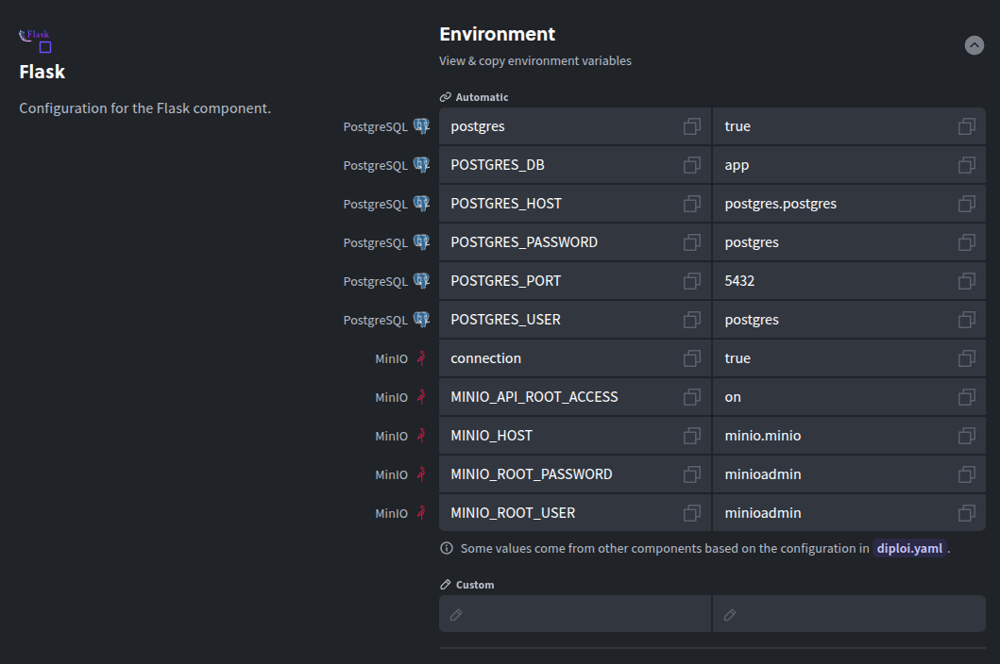

Updated <time datetime="2025-09-23T01:00:05.000Z">September 23, 2025</time>

###### Launch new Flask apps on Diploi with zero server setup

Flask is a lightweight Python framework for building web APIs and full-stack apps. It’s minimal by design, easy to extend, and great for everything from quick prototypes to production services.

In this guide, we’ll take a Flask project and get it running on Diploi instantly. You won’t need to write YAML or provision machines. Diploi builds, configures, and runs it for you.

We’ll go from creating your Flask project in Diploi, to launching it to production, and finally adding a custom domain.

Let’s begin.

    <iframe width="560" height="315" src="https://www.youtube.com/embed/IaK1I37tHGE?si=eTwLhYkY4P86an-p" title="Launching a Flask application with Diploi" frameborder="0" allow="accelerometer; autoplay; clipboard-write; encrypted-media; gyroscope; picture-in-picture; web-share" referrerpolicy="strict-origin-when-cross-origin" allowfullscreen></iframe>

---

## Table of contents

- [Getting started with Flask on Diploi](#getting-started-with-flask-on-diploi)
- [Launching your Flask app to Production](#launching-your-flask-app-to-production)
- [Configuring a custom domain for your Flask app](#configuring-a-custom-domain-for-your-flask-app)
- [Trying out Flask for the first time?](#new-to-flask)
- [References](#references)

---

## Getting started with Flask on Diploi

### What you need

To follow along, you’ll need:

- A GitHub account
- A Diploi account

That’s it. If you don’t have a Diploi account yet, you can create one for free, no credit card required.

### How to create a Flask app

After signing in, do the following:

- Create a new project: Click the **Create Project +** button on your Dashboard.  
  

- Choose Flask as the component: In **Pick Components**, select **Flask** (it may appear under Python/Flask). If you want a full-stack setup, add a frontend component here too, for example, pair a Flask API with a React UI in the same project.  
  

- Add optional services: In **Pick Add-ons**, attach databases or caches if you need them (PostgreSQL, Redis, etc.). You can skip this for now and add them later by modifying the `diploi.yaml` file in the root of the project.
  

- Create a repository: Select **Create Repository** so Diploi can generate a new GitHub repo for your code. Name the project and confirm, Diploi will scaffold a minimal Flask starter for you.  
  

- Launch the stack: Click **Launch Stack**. Diploi will provision the environment and boot your Flask app.  
  

In a minute or two, you’ll have a fresh Flask project running on Diploi with a public URL and SSL-protected. Behind the scenes, Diploi handles a Kubernetes cluster and networking for you.

By default, new projects start with a **Remote Development** workspace, so you can code immediately, without having to clone your repository locally.

You can start using the Remote Development environment in two ways:

- Open the browser IDE and edit files right there.  
  

- Or connect your local editor (e.g., VS Code or Cursor) over SSH to the remote environment, so it feels like coding on your own machine.
  

Either way, there’s no need to clone the repo or set up Python, virtualenv, or `pip` locally. The environment is already configured in the cloud.

Diploi will hot-reload or restart the app as needed so you can preview changes instantly.  

---

## Launching your Flask app to Production

When you’re happy with your Flask app and it’s time to promote it to a production environment, do the following:

- Push your changes to GitHub: We recommend you use different branches for each stage of your application, a popular strategy is Git Flow.

- Open your project dashboard: In the Diploi console, navigate to your Flask project’s page.
  
  
- Create a new deployment: Click **Create Deployment +** and the select **Production** for the stage.
  

- Choose a cluster size: Select the plan/resources that fit your needs (you can start small and scale later).
  

- Select the source branch: Pick the Git branch to deploy (e.g., `main` or `prod`).  
  

- Configure environment variables (if needed): Add any variables your app requires in production.
  

- Launch the deployment: Click **Create Deployment** to spin up the production instance.  
  

Diploi then builds your app for production and deploys. Your Flask app is now live in Production.

Next, let’s point your own domain to it.

---

## Configuring a custom domain for your Flask app

By default, Diploi assigns your production deployment a random `.diploi.me` subdomain with HTTPS. For example, your app might be available at `my-app.diploi.me`.

If you want to use your own domain, follow these steps:

- Open the Options tab: In your Production deployment, go to the **Options** tab from the deployment dashboard.
  

- Disable generated endpoints: In the **Endpoints** section, switch off **Use Auto-Generated Endpoints** to enable custom domain settings.

- Enter your domain: Check **Use custom domain** and type the hostname you want to use, for example `yourdomain.com`.  
  

- Save the changes: Scroll to the bottom of the page, and then click **Save Changes** to apply the configuration. Diploi will update the deployment settings.

- Point DNS: In your DNS provider, create a **CNAME** record for the chosen hostname and point it to `edge.diploi.com`.

After the DNS settings propagate, your Flask app be accessible using your custom domain. SSL certificates are issued automatically once the domain resolves to Diploi. The updates can happen quickly, but sometimes it can take up to about 30 minutes.

---

## New to Flask?

You can spin up a temporary Flask environment on Diploi and explore what's possible within minutes. Here are two quick ways to test-drive Flask on Diploi:

- Option 1 - Launch a trial without signing up
  Open the Diploi StackBuilder <a href="https://diploi.com/#StackBuilder" target="_blank">https://diploi.com/#StackBuilder</a> and start a free trial project. Pick the **Flask** stack (plus any extras you want) and hit **Launch**. No account, no credit card, just a disposable Flask environment you can poke around in.

- Option 2 - Quick Launch with your Diploi account
  If you’re logged in, create a new project as usual and, in the **Repository** step, choose **Quick Launch** instead of linking GitHub. Diploi will provision a ready-to-use Flask app so you can experiment immediately, no permanent repo until you decide to create one.
    

With that, you can go from zero to a deployed Flask service on Diploi, although keep in mind that these options are not meant for production apps, they are only for testing.

---

We hope this guide helps you get your Flask app online faster. If you have questions or want to share what you’re building, join our Discord community and say hello.

---

## References

- Official Flask Documentation https://flask.palletsprojects.com/en/stable/
- Flask in Diploi http://diploi.com/component/flask
- Diploi Components https://docs.diploi.com/building/components
- Custom Domains https://docs.diploi.com/deploying/custom-domain/
