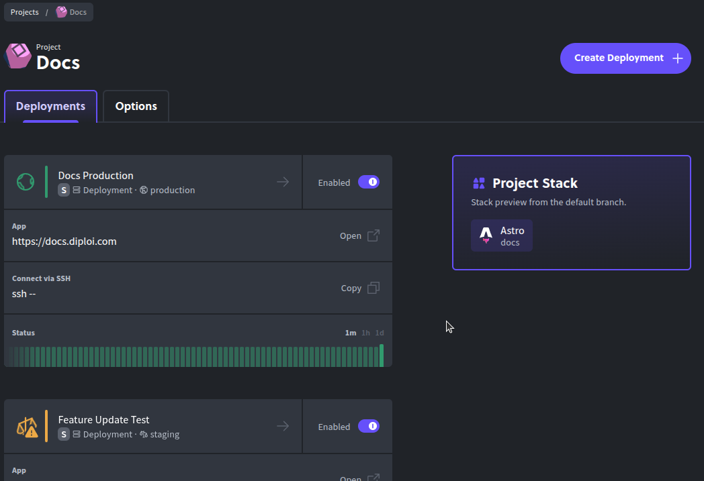
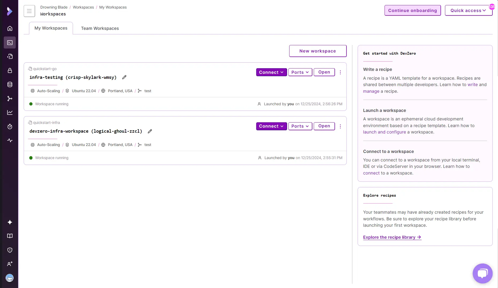
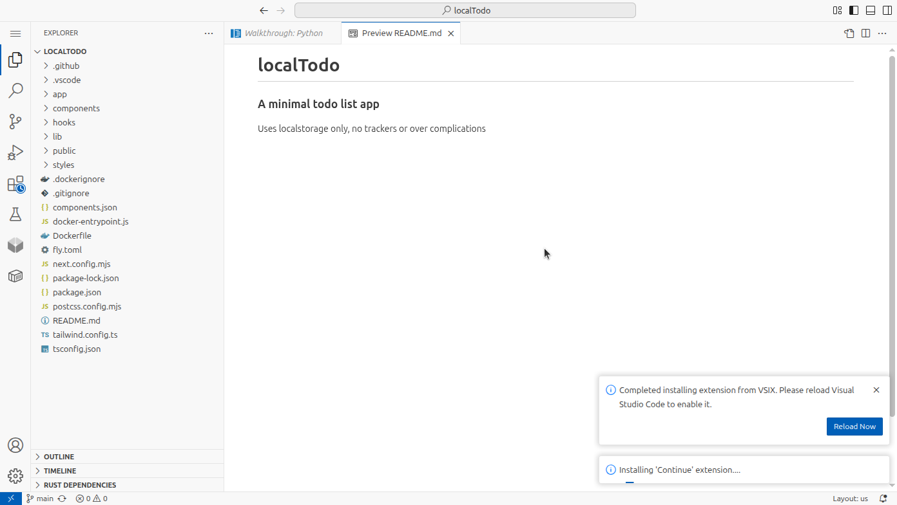
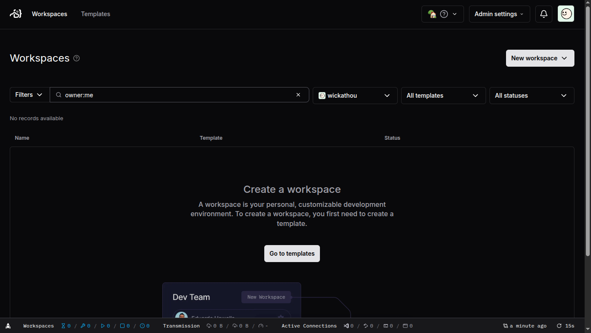
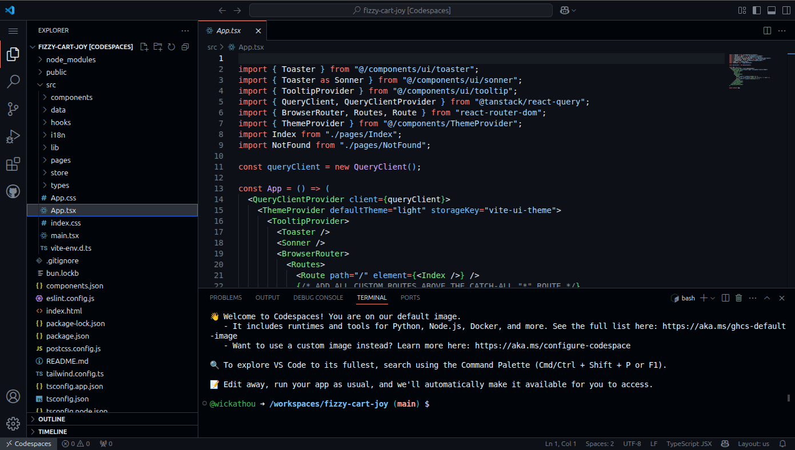
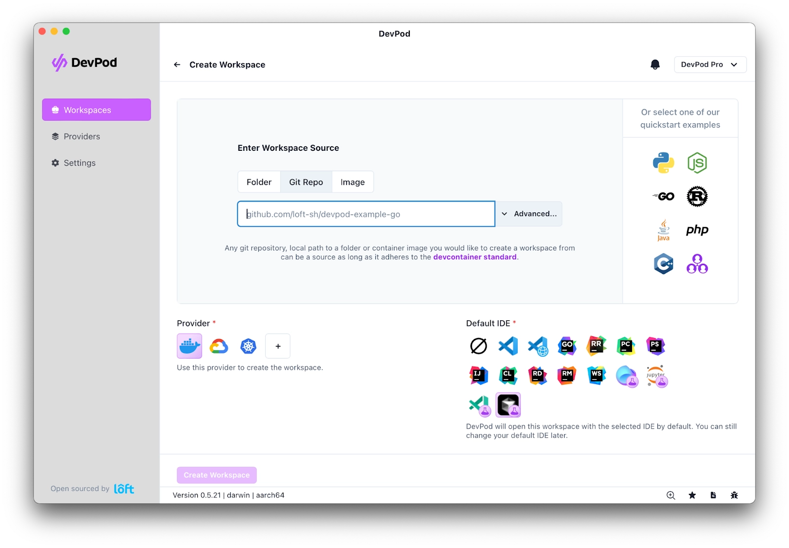
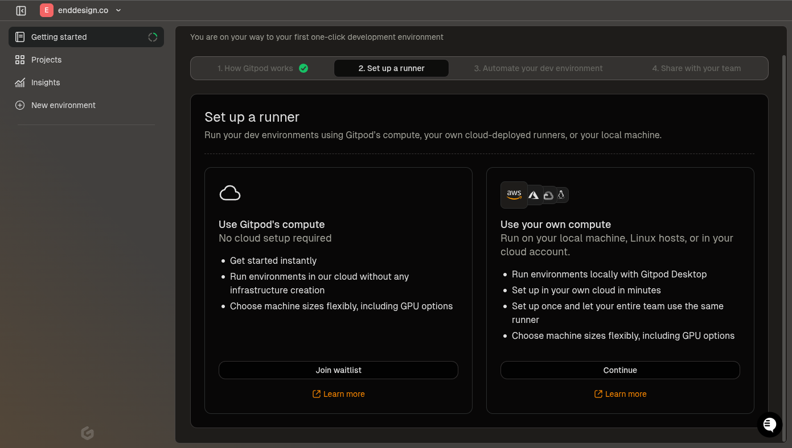

###### If you code locally, probably you heard this at least once

[Jump to the list of remote development platforms](#top-7-remote-development-platforms-in-2025)

Or maybe your version of `node/python/<insert other languages, runtime or framework>` is too old or too new to run the application you are working on, so you need to install an additional tool to manage different versions of said tool

When it is not an issue with the tooling necessary to run your application, it can be a config issue or environment variables missing

Well, there are ways to avoid the additional work required to run an application locally. One example that blew my mind was how the team at OkTurtles handles all of their config, where you don't need any `.env` files or special config for one of their very complex projects, [Group Income](https://github.com/okTurtles/group-income), where they put a lot of effort to make the process of onboarding new people and working collaboratively as seamless as possible

Check their video about [how they handle passwords inside Group Income](https://www.youtube.com/watch?v=AaX28k9pJ8s)

BUT... that was a lot of effort and time dedicated to making their product work as consistent as possible for all developers, regardless of the machine you are using

So what about us? I don't want to spend time doing that and chances are you neither...

This leads me to introduce you to:

---

## Remote Development Environments

Remote development environments are platforms that allow you to code, run, and test your applications in the cloud, eliminating the need for local setup and configuration. This means you can work from anywhere, on any device (even from your mobile browser although with limitations), without worrying about compatibility issues or missing dependencies

The benefits of using remote development platforms include:

- **Consistency**: Ensures that everyone on your team is using the same environment, reducing the "it works on my machine" problem
- **Accessibility**: Access your development environment from any device with an internet connection, making it easier to work on the go
- **Resource Management**: Offload resource-intensive tasks to the cloud, freeing up your local machine
- **Collaboration**: Share your development environment with team members, making it easier to collaborate on projects
- **Scalability**: Easily scale your development environment to handle larger projects or more complex applications
- **Cost-Effective**: Many platforms offer free tiers or pay-as-you-go pricing, making it affordable for individuals and small teams
- **Security**: Remote platforms often provide better security measures than local setups, protecting your code and data
- **Environment Isolation**: Each project can have its isolated environment, preventing conflicts between dependencies
- **Integrated Tools**: Many platforms come with built-in tools for version control, debugging, and deployment, streamlining your workflow

There might be more benefits, but these are the ones I find most relevant for me. When I started working at Diploi, since our product supports remote development, I have been using it for all of my projects, specially for testing and experimenting with new ideas

An example of this is how we use Diploi to develop and test changes to our documentation, where we create a project for our team to host our Docs, and then we can create multiple environments for each team member or feature we are working on

This way I can start coding without running anything locally, and I can share my work with the team by just sharing the link to the project, which is hosted on Diploi

For example, while writing this blog, I created a new remote development environment to show how it works in about 60 seconds:

<iframe width="560" height="315" src="https://www.youtube.com/embed/Xu96kVVzgqY?si=aSJHztxYhP_Y6umV" title="How to start a Remote Development Environment and code in the Browser using Diploi" frameborder="0" allow="accelerometer; autoplay; clipboard-write; encrypted-media; gyroscope; picture-in-picture; web-share" referrerpolicy="strict-origin-when-cross-origin" allowfullscreen></iframe>

As you can see, no local setup is required. I simply created a new deployment, and I can start coding right away. But that's not why you are here, you want to know which remote development platforms are available, so let's get to it!

---

## Top 7 Remote Development Platforms in 2025

---

### DevZero

https://www.devzero.io/cloud-development-environment

> "Ready-to-Code, Cost Efficient Dev Environment."

DevZero is a cloud-based development platform designed to provide developers with ready-to-code, production-like environments. By mirroring production setups, it aims to eliminate the common "it works on my machine" problem, ensuring consistency across development and deployment stages. DevZero leverages MicroVMs to offer isolated environments that dynamically scale resources, optimizing performance and cost

Known as Workspace or DevBoxes in DevZero, these allow developers to create isolated, customizable environments for development, testing, and deployment. These environments are built dynamically from a predefined configuration file called a recipe, which specifies dependencies, tools, and resources.

Each workspace is provisioned with its own Kubernetes cluster and can be launched in a region of the user's choice. This approach ensures consistent environments for team members and supports demanding workloads like CI/CD pipelines and data processing. The next step for users is to create a workspace by selecting or configuring a recipe and launching it on the DevZero platform.

#### IDE options supported

To access and work within DevZero's Workspaces, you can use JetBrains and VS Code with the Remote SSH extension. For either IDE, you will need to install the DevZero's CLI to connect to your workspace

#### Anything free?

DevZero used to offer a free tier, but it seems that they have moved away from this model 🥲

#### Pricing?

DevZero no longer showcases its pricing plans on its website, and the latest information available online comes from SaaSworthy which lists the following plans:

**Starter Plan**: Allows up to 2 users per team and 2 workspaces per user

- **Price**: $0/month

**Pro Plan**: Includes custom roles, up to 15 users, 2 active workspaces per user, and 30 workspaces per team

- **Price**: $39.95 per user per month

**Growth Plan**: Offers storage volumes/buckets, integrations with existing infrastructure, up to 15 teams (max 15 users per team), administrative dashboards, usage controls/policies, and dedicated support SLA

- **Price**: $429.95 per team per month

**Enterprise Plan**: Provides self-hosted options, SSO support, external secret manager, APM, full RBAC, and dedicated support rep with SLA

- **Price**: Custom pricing

https://www.saasworthy.com/product/devzero-io/pricing

But keep in mind that these prices are not directly from DevZero's website and were last updated on the 26th of August 2024, so they are probably not accurate anymore

#### Something else?

You can launch workspaces on DevZero in different regions. The region where a workspace is launched depends on the user's team and subscription tier. Upon signing up, a default region is set, but users can change this preference in their user settings

#### Video demo?

<iframe width="560" height="315" src="https://www.youtube.com/embed/ft6ilE0OjTI?si=bVmlEXnPRI9DQkma" title="Introduction to Cloud Development Environments with DevZero" frameborder="0" allow="accelerometer; autoplay; clipboard-write; encrypted-media; gyroscope; picture-in-picture; web-share" referrerpolicy="strict-origin-when-cross-origin" allowfullscreen></iframe>

---

### Codeanywhere

[https://codeanywhere.com/](https://codeanywhere.com/)

> "The AI Cloud IDE"

Codeanywhere is a cross-platform cloud-integrated development environment (IDE) that enables users to write, edit, collaborate, and run web development projects directly from a web browser or mobile device. It supports over 75 programming languages, including HTML, JavaScript, Node.js, PHP, Ruby, Python, and Go

The platform offers features such as real-time collaboration, version control integration with GitHub, GitLab, and Bitbucket, and the ability to connect to remote file systems via SFTP. Codeanywhere supports DevContainer.json for standardized workspace configurations which you can customize in multiple ways

#### IDE options supported

Codeanywhere provides a browser-based IDE powered by Visual Studio Code where you can import your own VS Code extensions, themes, and settings. Additionally, it offers AI-powered code completion and suggestions using the [Continue.dev](https://www.continue.dev/) extension

#### Anything free?

Codeanywhere offers a free tier with an allowance of 20 hours of use, so users can explore the platform before committing to a subscription

#### Pricing?

Codeanywhere has monthly, annual, and 2-year plans, with the following options:

**Free Plan**: One-time usage with essential features for getting started

- **Price**: $0 (one-time usage)

**Basic Plan**: Ideal for growing teams with more flexibility and workspace options

- **Price**: $12 monthly | $9.60 per member/month, billed annually | $8.40 per member/month, billed every 2 years

**Premium Plan**: Maximum value for teams needing more resources and parallel workspaces

- **Price**: $29 monthly | $23 per member/month, billed annually | $20 per member/month, billed every 2 years

**Enterprise Plan**: Custom solutions for organizations with on-premise or cloud deployment need

- **Price**: Custom pricing (contact sales)

#### Something else?

Codeanywhere supports on-premises deployment options, allowing users to host the platform within their own infrastructure. The platform is also SOC2 Type II, ISO 27001, and GDPR compliant, ensuring high standards of security and data protection

#### Video demo?

<iframe width="560" height="315" src="https://www.youtube.com/embed/h-vXh88gvaE?si=xEbCm0pSJE-spBjb" title="Codeanywhere Commercial" frameborder="0" allow="accelerometer; autoplay; clipboard-write; encrypted-media; gyroscope; picture-in-picture; web-share" referrerpolicy="strict-origin-when-cross-origin" allowfullscreen></iframe>

---

### Coder

[https://coder.com/](https://coder.com/)

> "Secure environments for developers and their agents"

Coder is a self-hosted cloud development platform that allows you to code in the cloud without needing a local setup. The main use of Coder is to provide a way to launch and manage your virtual development environments from a single dashboard, without having to set up each environment manually

You can define your development environments using templates, where you can launch remote development servers using Kubernetes or Docker, and then launch them from the Coder dashboard. Besides managing your environments, Coder also provides a way to code using their own open source IDE, Coder-server, or using your own IDE by connecting via SSH

#### IDE options supported

Officially supports VS Code, JetBrains IDEs, and their own web-based IDE

#### Anything free?

Coder is open‑source and allows you to self-host so you would only worry about the costs of your infrastructure. You can also start a Premium trial which has additional features intended for teams and enterprises

#### Pricing?

Coder is open source and it is available in two editions

**Community**: Open-source edition, self-hosted, and free to use

- **Price**: Free

**Premium**: Paid edition with additional features such as global support, access controls, audit logging, workspace autoscaling and proxying, branding, and enterprise-grade governance

- **Price**: Custom pricing

#### Something else?

As I mentioned before, Coder also has a web-based IDE called Coder-server which is based on VS Code. You can use it to code in the browser or to connect to your remote development environments via SSH

#### Video demo?

<iframe width="560" height="315" src="https://www.youtube.com/embed/zzxnEeSkU5w?si=85aTWGNz8KjueKQK" title="Favorite Features and Use Cases in Coder" frameborder="0" allow="accelerometer; autoplay; clipboard-write; encrypted-media; gyroscope; picture-in-picture; web-share" referrerpolicy="strict-origin-when-cross-origin" allowfullscreen></iframe>

---

### GitHub Codespaces

[https://github.com/features/codespaces](https://github.com/features/codespaces)

> "Secure development made simple"

GitHub Codespaces offers managed, container-based development environments hosted in the cloud. You can spin up a live VS Code environment on the browser, directly from any GitHub repo, complete with full terminal support

These environments can be configured using DevContainer.json files, allowing project-specific setups with dependencies, tools, and custom init commands

#### IDE options supported

You can use the web-based VS Code IDE, and it also supports local VS Code instances via the GitHub Codespaces extension

#### Anything free?

Personal GitHub accounts receive 120 hours of free Codespaces usage per month and 15 GB of storage. Codespace hours are calculated based on the number of cores and the duration of usage. For example:

- A 2-core machine used for 1 hour equals 2 core hours
- An 8-core machine used for 1 hour equals 8 core hours
- An 8-core machine used for 2 hours equals 16 core hours

#### Pricing?

Codespaces bills based on the number of core hours used and the storage consumed:

**Codespaces compute (2 core)**:

- **Price**: $0.18 per 1 hour

**Codespaces compute (4 core)**:

- **Price**: $0.36 per 1 hour

**Codespaces compute (8 core)**:

- **Price**: $0.72 per 1 hour

**Codespaces compute (16 core)**:

- **Price**: $1.44 per 1 hour

**Codespaces compute (32 core)**:

- **Price**: $2.88 per 1 hour

**Codespaces storage**: Storage resource for Codespaces

- **Price**: $0.07 per 1 GB-month

#### Something else?

Codespaces can be used for pull requests, allowing you to review and test changes in a live environment before merging

#### Video demo?

<iframe width="560" height="315" src="https://www.youtube.com/embed/sYJ3CHtT6WM?si=-pPqysORlEF4hfP7" title="What is Codespaces" frameborder="0" allow="accelerometer; autoplay; clipboard-write; encrypted-media; gyroscope; picture-in-picture; web-share" referrerpolicy="strict-origin-when-cross-origin" allowfullscreen></iframe>

---

### DevPod

[https://devpod.sh/](https://devpod.sh/)

> Codespaces but... Open Source, Client Only, Unopinionated” 🌱

DevPod is an open‑source tool for creating reproducible development environments using the DevContainer standard. It connects your local IDE to workspaces running locally, in Kubernetes, or on any cloud provider

DevPods run based on a `devcontainer.json`, to create consistent environments. You can use DevPod to run your development environments on your own infrastructure. It supports multiple IDEs and provides a CLI and GUI for managing workspaces

#### IDE options supported

DevPod supports VS Code Browser or Desktop, JetBrains IDEs, and connecting any IDE via SSH

#### Anything free?

DevPod is open source and free and uses your own infrastructure to run your workspaces, and only runs on your local machine

#### Pricing?

There seems to be no paid version for DevPod, which I think is because DevPod is part of a larger ecosystem of tools that Loft (creators of DevPod) use to provide tools for Virtualization and Kubernetes management

#### Something else?

DevPod provides a way to create CLI programs called Providers, that enable the creation, management, and running of user-requested workspaces. They support various backends, such as cloud services or container environments. There are two main types:

**Machine providers**, which manage virtual machines (e.g., AWS Provider using EC2)

**Non-Machine providers**, which work directly with containers (e.g., SSH, Kubernetes, or Docker)

Provider configurations are defined in a `provider.yaml` file, and you can learn how to add or develop your own providers through DevPod's documentation

#### Video demo?

<iframe width="560" height="315" src="https://www.youtube.com/embed/87oHtFO5lkc?si=BKpFnu6uH93PE0G9" title="Introducing DevPod - Codespaces but Open Source" frameborder="0" allow="accelerometer; autoplay; clipboard-write; encrypted-media; gyroscope; picture-in-picture; web-share" referrerpolicy="strict-origin-when-cross-origin" allowfullscreen></iframe>

---

### Gitpod

[https://www.gitpod.io/](https://www.gitpod.io/)

> “Productivity starts with your AI-ready development environment”

Gitpod is a cloud development environment platform that delivers on-demand, fully automated workspaces based on pre-configured `devcontainer.json` files. These environments come ready-to-code with all required tools and dependencies, support any Git repository, and can run in the browser, locally via desktop, or self-hosted in private infrastructure

Gitpod automates the setup of development environments, allowing developers to focus on coding rather than configuration. It supports multiple IDEs and provides features like prebuilds, which automatically prepare workspaces with the latest code changes, and ephemeral workspaces that can be spun up and down as needed

#### IDE options supported

Gitpod works with any editor that uses SSH to connect to a remote backend, which means it supports a wide range of IDEs and code editors, including VS Code, JetBrains IDEs (such as IntelliJ IDEA, PyCharm, and WebStorm), Cursor, Windsurf, Zed, and any other IDE that can use SSH to connect to a remote development environment

#### Anything free?

Gitpod has a free tier that allows you to run up to 10 development environments

#### Pricing?

Gitpod has three tiers:

**Free**: Best for individuals and testing the waters

- **Price**: Free

**Core**: Coming soon, best for heavy users and small teams

- **Price**: Not yet available

**Enterprise**: Best for large organizations with additional compliance requirements

- **Price**: Custom pricing

#### Something else?

Gitpod provides an SDK that allows developers to interact programmatically with Gitpod environments for automation and infrastructure management. It supports Python, Node/Typescript, and Go

#### Video demo?

<iframe width="560" height="315" src="https://www.youtube.com/embed/R6FQ39sitAQ?si=6s4mU0X33jMtBfpg" title="Gitpod in under 120 seconds" frameborder="0" allow="accelerometer; autoplay; clipboard-write; encrypted-media; gyroscope; picture-in-picture; web-share" referrerpolicy="strict-origin-when-cross-origin" allowfullscreen></iframe>

---

### Diploi

[https://diploi.com/](https://diploi.com/)

> “Magical Developer Experience”

Diploi is a development and deployment platform that enables developers to spin up full-stack applications quickly and simplifies both development and deployments by reducing the configuration required to launch environment online

You can launch a new development environment for an application in seconds, with the ability to start coding in the browser or connecting your own IDE via SSH. Diploi focuses on simplifying the developer experience by automating infrastructure management, deployments, and CI/CD pipelines

Using a visual stack builder, developers select components (e.g., Next.js, Astro, Node/Bun) and services (PostgreSQL, Redis, MongoDB) to generate a preconfigured monorepo and deployment setup, which you can try out yourself without signing up by visiting [diploi.com/#StackBuilder](https://diploi.com/#StackBuilder)

#### IDE options supported

Using Diploi you can start coding in the browser using our implementation of Code-server to code in browser and we also support VS Code and Cursor out of the box, or if you use another IDE, you can connect via SSH

#### Anything free?

Diploi offers €50 free credits upon signup to explore and experiment with the platform

#### Pricing?

Diploi operates on a pay-as-you-go model, with no fixed monthly fees. You only pay for the time your environments are active and the size of the cluster you use for your deployments:

**Diploi Cluster (S)**: 2 vCPUs, 4 GB RAM

- **Price**: €0.026 per 1 hour

**Diploi Cluster (M)**: 2 vCPUs, 8 GB RAM

- **Price**: €0.048 per 1 hour

**Diploi Cluster (L)**: 4 vCPUs, 16 GB RAM

- **Price**: €0.089 per 1 hour

**Diploi Cluster (XL)**: 8 vCPUs, 32 GB RAM

- **Price**: €0.182 per 1 hour

**Diploi Storage**: Persistent storage for your deployments

- **Price**: €0.002 per 1 GB-hour

#### Something else?

Diploi has a way to define environments using a `diploi.yaml` file which contains the configuration to build infrastructure for a deployment. It defines components and add-ons, each with a name, unique identifier, package URL, and version. The file allows for importing environment variables from other components, which can be remapped or filtered using wildcards

#### Video demo?

Here’s a quick intro to using Diploi:

<iframe width="560" height="315" src="https://www.youtube.com/embed/X-olQzRPZMY?si=v1zl7D4QxnOvhgPG" title="Diploi features explained in 60 seconds" frameborder="0" allow="accelerometer; autoplay; clipboard-write; encrypted-media; gyroscope; picture-in-picture; web-share" referrerpolicy="strict-origin-when-cross-origin" allowfullscreen></iframe>

---

## Choosing the Right Platform

What remote development platform works best, depends on your specific needs, stack, and budget. Here’s a quick summary to help you decide:

- **Diploi:** Best for developers who not only want to code without local setup but also want a simplified deployment process for their application's lifecycle, especially if you want to launch full-stack applications quickly with minimal configuration

- **DevZero:** Best for teams needing production-like environments with dynamic scaling and isolated workspaces, especially if you want to self-host

- **Codeanywhere:** Best for those who want a cross-platform cloud IDE with real-time collaboration and version control integration, especially if you want to use AI-powered code completion

- **Coder:** Best for teams looking for a self-hosted solution to manage their own development environments with full control over configurations and IDE options

- **GitHub Codespaces:** Best for developers who want seamless integration with GitHub and prefer using VS Code in the browser or locally, especially if you want to use pre-configured devcontainers

- **DevPod:** Best for those who want an open-source, client-only solution to create reproducible development environments using DevContainer standards, especially if you want to self-host or run locally

- **Gitpod:** Best for teams needing fully automated, ephemeral workspaces with prebuilds and support for multiple IDEs, especially if you want to use a wide range of IDEs and code editors

---

Do you have a favorite remote development platform? Or maybe you are using one that is not listed here? Let me know in the comments

---

In case you are curious, [Test-drive Diploi ✨](https://diploi.com/), no registration required

---

**References:**

- [DevZero](https://www.devzero.io/)
- [Codeanywhere](https://codeanywhere.com/)
- [Coder](https://coder.com/)
- [GitHub Codespaces](https://github.com/features/codespaces)
- [DevPod](https://devpod.sh/)
- [Gitpod](https://www.gitpod.io/)
- [Diploi](https://diploi.com/)
- [OkTurtles Group Income](https://groupincome.org/)
