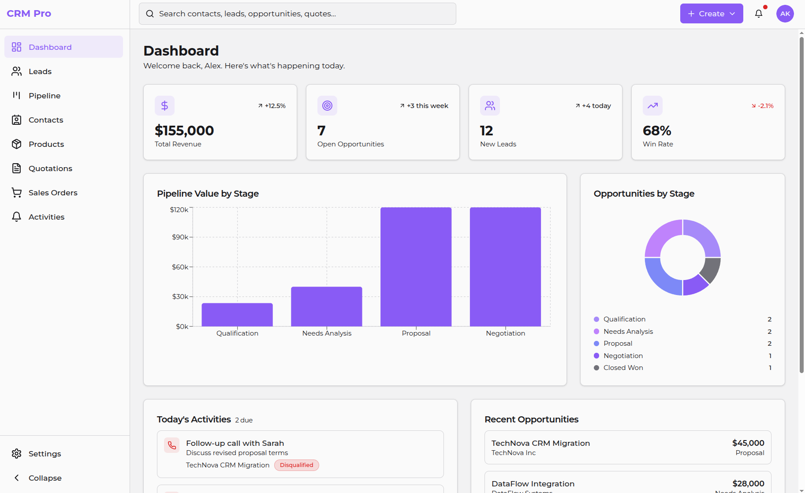
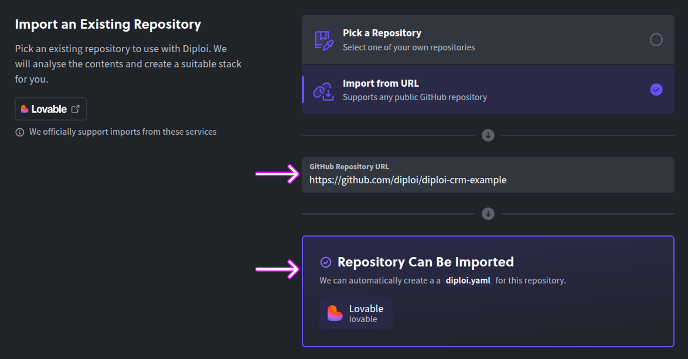
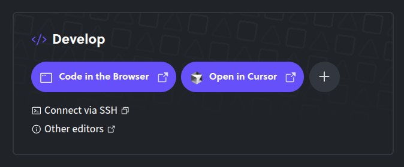
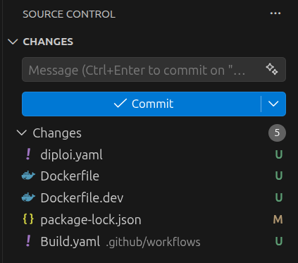
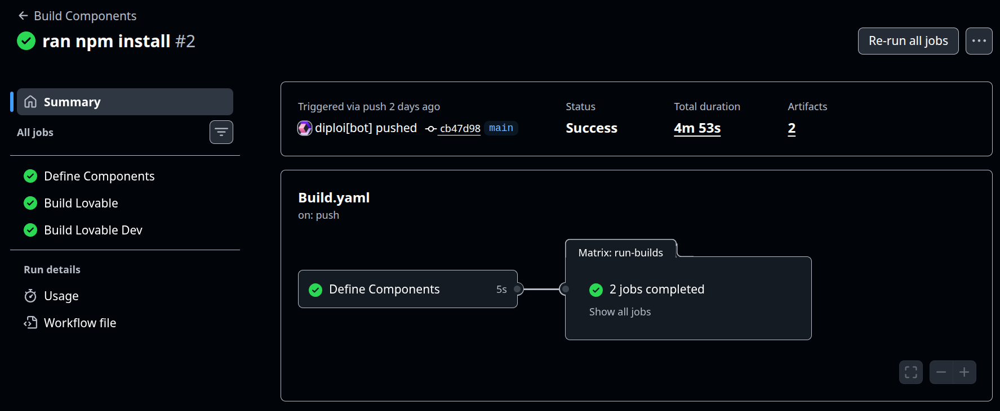
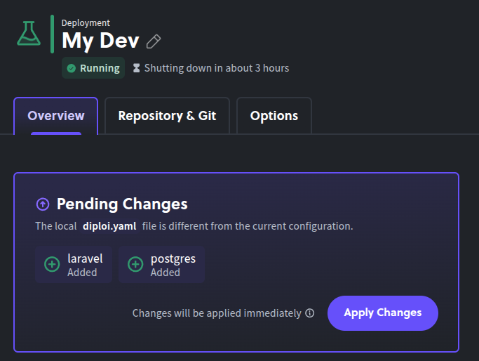
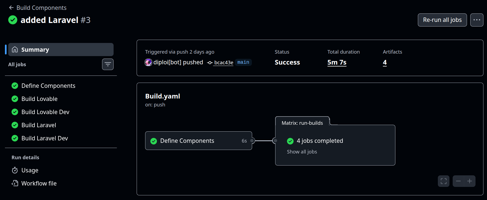
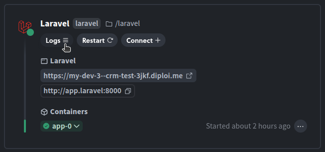
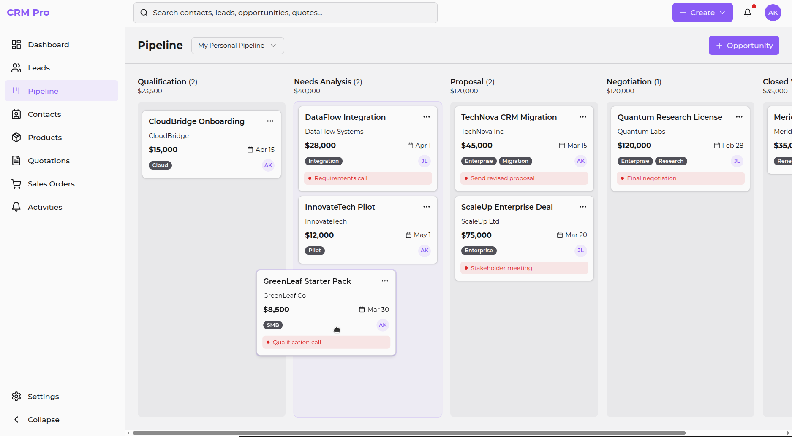

import LongCodeScrollBlock from '../../../components/LongCodeScrollBlock.astro'
import { promptExample, promptProductPrinciple, promptInformationArchitecture, promptAppShellLayout, promptFeatureLayouts, promptRoles } from './lovablePromptExamples'
import { agentsExample } from './agentsmdExamples'
import {
  prompt1Scaffold,
  prompt2Migrations,
  prompt3Models,
  prompt4TypesAndUtils,
  prompt5UI,
  prompt6AppLayout,
  prompt7CRMComponents,
  prompt8Forms,
  prompt9Backend1,
  prompt10Backend2,
  prompt11Frontend1,
  prompt12Frontend2,
  prompt13UserRoles,
  prompt14Final
} from './cursorPromptExamples'
import Workflow from './workflow.svg'
import ImportedLovableCluster from './imported_lovable_project_cluster.svg'
import FinalClusterSetup from './final_cluster_setup.svg'

Updated <time datetime="2026-03-11T11:00:00.000Z">March 10, 2026</time>

---

###### SaaS-pocalypse is real!

When you run a business, you will need a set of software tools that make your life easier. Typically, you would use a SaaS product that gives you what you need, but never quite to the extend you need it. Probably you get 3 features that are important for a set fee, but a 4th feature you need cost you double or hasn't been created yet.

That was the *typical* situation **before AI**. Not anymore 😌

Now you can create the tools you need, with the features you actually need and the user experience that fits you. In this blog, we'll explore how you can create your own CRM application, showcasing a workflow that takes you from first prompt to production-ready product.

We will use:

- **Lovable** to create the interface of our CRM
- **Cursor** to create a full-stack Laravel app using the interface created by Lovable
- **Diploi** to host our entire app

This guide will give you a general blueprint that you could follow for replacing (almost) any SaaS tool you currently use.

---

## Table of contents

- [Getting started with OpenClaw on Diploi](#getting-started-with-openclaw-on-diploi)
- [Launching your OpenClaw instance to Production](#launching-your-openclaw-instance-to-production)
- [Configuring a custom domain for your OpenClaw gateway](#configuring-a-custom-domain-for-your-openclaw-gateway)
- [References](#references)

---

## Workflow overview

The workflow we'll follow starts with the prompt to create the UI for our CRM on Lovable, then export it to Diploi for hosting, add Laravel, and finally use Cursor's AI agent with context files to transform a prototype into production software.

<Workflow style='padding:32px'/>

---

### Step 1: prompting a CRM into existence with Lovable

Using Lovable we'll generate a prototype, and it will use React to create it. We'll use the following prompt:

<LongCodeScrollBlock codeContent={promptExample}/>

Each section of this prompt has a function and it will help you write prompts like this for any app you want to build, not just a CRM.

### Anatomy of the prompt

When vibe-coding, you must think of your initial prompt as both an instruction and a blueprint with layers.

The instruction part of your prompt is the easy part, which basically tells the AI what you want to get done.

The blueprint part of your prompt, tell the AI the how you want it done. Any details skipped when you define your blueprint, will be either made up by the AI or skipped entirely.

In general, a prompt to generate an business application should have the following layers:

- Product principles, which defines how the app should feel.
- Information architecture, defines what pages/modules must exist.
- App layout, defines the general UI of everything.
- Feature layouts, specifies how users interact and view each feature.
- User roles, which determines the types of users and what they can do or cannot do.

#### 1. Product principles

	> <LongCodeScrollBlock codeContent={promptProductPrinciple} windowHeight='200px'/>
	>
	> The prompt opens with 5 design values: fast one-hand operation, global search, consistent entity pages, activity-first design, and personal + team views.
	>
	> Without these, AI builders make arbitrary UX decisions. Each principle constrains hundreds of micro-choices, "fast to operate with one hand" tells the AI to prefer inline actions over modals, sidebars over popups, and keyboard shortcuts over mouse-only flows.
	>
	> **Adapt it:** Write 3-5 principles about how your app *feels* to use, not what it does. For a project management tool, for example, might say "everything is a timeline" and "drag-and-drop is the primary interaction."

#### 2. Information architecture:

	> <LongCodeScrollBlock codeContent={promptInformationArchitecture} windowHeight='200px'/>
	>
	> A flat list of 9 modules (Dashboard, Leads, Pipeline, Contacts, Products, Quotations, Sales Orders, Activities, Settings) acting as the app's sitemap. This determines the navigation structure, routing, and how many page components get generated, so you don't need to spend credits on features your app won't need.
	>
	> **Adapt it:** Include a behavior hint after each module name, like "list view, qualification, convert to opportunity" for Leads. These hints tell the AI which UI pattern to use (table, kanban, builder, form, etc).

#### 3. App layout:

	> <LongCodeScrollBlock codeContent={promptAppShellLayout} windowHeight='200px'/>
	>
	> This describes the UI for the app and available actions for each page. This is important because every page inherits this structure, so getting it right means every page stays consistent. Although, as with anything AI, it is not perfect and you still need to make sure it is actually consistent.
	>
	> **Adapt it:** We recommend that you define three core details for your application using this section: (1) what's always visible (top bar, sidebar), (2) what varies per page (the content area), and (3) what interaction patterns repeat (filters, saved views, right panel settings).

#### 4. Detailed layouts by feature:

	> <LongCodeScrollBlock codeContent={promptFeatureLayouts} windowHeight='200px'/>
	>
	> This is the longest section for the prompt, and includes detailed specs for the different views of the app. For the case of our CRM, we define:
	>
	>	- Pipeline kanban with drag-and-drop and card field priorities
	>	- Lead management with a conversion flow
	>	- Quotation builder with Odoo-like line items and inline product search
	>	- Unified activity/reminder system
	>	- Lists and detail page layouts, for products, contacts and other views that display data using tables
	>
	> **Adapt it:** Prioritize describing interactions (drag, inline edit, typeahead search), because interactions are where AI tools tend to make the worst assumptions. For features that could be considered as "typical", like a contact form, you don't need detailed specs, which will helps you create prompts that are more precise and consume less tokens.

#### 5. Defining user Roles:

	> <LongCodeScrollBlock codeContent={promptRoles} windowHeight='200px'/>
	>
	> We set five different user roles:
	>
	> - Admin
	> - Sales Manager
	> - Sales Rep
	> - Read-only/Finance
	> - Support
	>
	> Each with their set of permissions and UI modifiers, so the user experience would have a dynamic feel, based on the role of each user. If you have a single type of user, you should still define it here, because if it's skipped, the AI might either generate a default user experience for all users, or create user categories and boundaries that it assumes as typical for the type of app being generated, which would be our of our control.
	>
	> **Adapt it:** Define roles even if there's only one user. It helps shape the db schema, data models and access patterns you'll need when adding a real backend later.

With these five sections, the prompt gives Lovable enough structure to generate a complete and opinionated frontend rather than a generic template. Here's what it produced:



We got a working navigation, responsive layouts, and interconnected views. The generated code uses React+Vite and has the following project structure:

```
src/
├── components/
│ └── layout/ # Core app layout
│ └── shared/ # Components used across multiple views/pages
│ └── ui/ # shadcn/ui primitives (Button, Card, Dialog, Table...)
├── pages/ # Route components (Dashboard, Leads, Pipeline...)
├── hooks/ # Custom React hooks
├── lib/ # Utility functions and data mocks
├── App.tsx # Main app with React Router
└── main.tsx # Entry point
```

At this point, we have only the frontend code, but the data layer is missing. So the next stage is to transform our application into a fullstack solution with Laravel.

---

## Step 2: Hosting and adding a working backend

We will move the prototype we built on Lovable to Diploi (yes, that's us 😊), where you can both develop using cloud development environments and host apps without configuring servers. Of course, you could host on any other platform you prefer or use other vibe coding tools to proceed from this point onwards.

In this guide, we are using Diploi because we want to promote our solution and we believe it would help you skip all configuration work required to launch an application online. Alternatively, you could avoid deploying online while we add a backend, and just clone your project in your local machine using `git clone your-repo` to continue developing, and only host it when you are ready.

### Exporting from Lovable to Diploi

You can bring **any** application built with Lovable to Diploi, by using GitHub and selecting the repository where you stored your app. You can start the import wizard by visiting https://diploi.com/lovable or signing up on Diploi and creating a new project.



If you use Diploi, you don't need to worry about dependencies since we create a remote development environment, to which you can connect using [Cursor via SSH](https://docs.diploi.com/building/add-ssh-key/).

Unlike platforms that only handle deployment (Vercel, Railway) or only handle development (Codespaces), Diploi handles both.

Plus, your project is hosted as a monorepo, and hosted as nodes where your frontend, backend, and database are stored in a single repo, and each node running your app components is isolated.

### Opening your project's cloud dev environment

Once your app is imported to Diploi, it is hosted as a **single-node Kubernetes cluster** with automatic SSL, hostnames, and CI/CD, which are all configured a set of files generated by Diploi.

<div style='display:flex;justify-content:center;padding:32px'>
	<ImportedLovableCluster />
</div>

You can access your code and terminal, to push the changes made to GitHub by either using the Browser IDE or opening your app with Cursor. In this guide, we'll use Cursor, but feel free to use any IDE.



Once you access your cloud development environment, the next step is to push the changes made by Diploi to your repository.



That will trigger the creation of a build using GitHub Actions, which creates one build for development and other for staging/production.



### Adding Laravel and PostgreSQL

At this point, we have imported our CRM frontend from Lovable to Diploi, and pushed any changes made by Diploi to our repository. Now we need to add Laravel and PostgreSQL.

In the root of your project, you'll find the `diploi.yaml` file. This file gives you control over the composition of your app. By modifying the `diploi.yaml` file, you can add other frameworks, databases and tools for your project. After importing from Lovable, your `diploi.yaml` will have the following:

```yaml
diploiVersion: v1.0
components:
  - name: Lovable
    identifier: lovable
    folder: /
    package: https://github.com/diploi/component-lovable#v2
addons: []
```

All you need to do now, is modify the content of the file to include Laravel and Postgres. To learn more about how to use this file, check https://docs.diploi.com/reference/diploi-yaml

```yaml
diploiVersion: v1.0
components:
  - name: Lovable
    identifier: lovable
    folder: /
    package: https://github.com/diploi/component-lovable#v2
  - name: Laravel
    identifier: laravel
    package: https://github.com/diploi/component-laravel#v12
    env:
      include:
        - postgres.*
addons:
  - name: PostgreSQL
    identifier: postgres
    package: https://github.com/diploi/addon-postgres#v17.2
```

Once the edit is done, your deployment will have pending changes which you must accept in order to get Laravel and Postgres running in the same deployment.



And now your project will have Laravel and Postgres running in your project, so next you need to push the changes to GitHub, in order to update the builds of your project.



Now our deployment has two additional pods which run Laravel and Postgres. So our setup can be illustrated as follows:

<FinalClusterSetup/>

---

## Step 3: setting up context files for Cursor and general advice to prompt safely

Here's where the migration from prototype to production begins. Before asking Cursor's AI agent to do anything, we need to establish the context which for Cursor, could be done in two ways:
- Creating an **AGENTS.md** file, which is a standard you can use with a broad variety of AI tools.
- Creating **.cursor/rules/**, which is the Cursor standard.

Both try to do the same, which is to tell the AI what to do, what to avoid and when to ask for additional instructions or context. In this guide, we will opt for creating an AGENTS.md file, because you can use it with pretty much any other tool out there. If you prefer using Cursor rules instead, check the best practices for it in this article https://cursor.com/docs/rules

#### AGENTS.md: one file to rule (almost all) AI agents/tools

AGENTS.md is an open standard with +20,000 open-source projects using it. All we need to do is create it in the root of your project, and Cursor will read it before planning changes.

In our case, we need to explain to the AI the overall logic for our app and the goals we want to achieve when we transition our CRM to use Laravel and Postgres. Let's walkthrough over the structure of the file:

- **Project Overview:** explains the monorepo split by defining that the root files are part of our Lovable prototype as read-only reference, and that all real implementation belongs in `/laravel`.
- **Stack and Conventions:** declares the exact backend, frontend, styling, routing, auth/permissions, queue, and package manager choices to prevent the AI from improvising.
- **Directory Structure:** provides a map of where controllers, models, policies, jobs, pages, components, types, hooks, and utilities must live.
- **Database Schema:** which lists the core tables by domain and tells the AI to keep naming aligned with schema definitions.
- **Key Relationships:** documents conversions and links between entities like lead to opportunity, quote to sales order, polymorphic activities, and board scope.
- **Coding Rules:** defines implementation constraints such as lightweight pages, reusable patterns, permissions checks, and shared UI conventions.
- **Key Backend Actions:** gives expected route patterns for high-impact operations like lead conversion, pipeline moves, and quotation send/accept flows.
- **UX Principles:** sets interaction goals such as activity-first design, personal plus team views, keyboard friendliness, and fast navigation.

<LongCodeScrollBlock codeContent={agentsExample}/>

Normally, we want to **keep AGENTS.md as lean as possible.** Since LLMs can follow about 150-200 instructions more reliably, the longer your file is, the more tokens will be consumed because this file gets loaded on every request.

Our goal is to do the least amount of prompting possible to get the end result we want, so we also have plan for our prompts so that we can avoid shallow outputs for all of our features, which would be the issue if we try to one-shot our app conversion to Laravel.

#### Use Git flow: push changes to your code before every new prompt

Cursor's agent (basically all other AI tools too) can delete and recreate files, silently revert changes, or lose sync during extended prompt sessions. So to limit the impact of any hallucinations from your AI of choice, follow this workflow:

```bash
git checkout -b feature/migrate-leads      # Create a feature branch for each new prompt

# [After you are satified with the result generated by your prompt, run the following commands]
git add .
git commit -m "<a description of what changes are being commited>"
git push --set-upstream origin feature/migrate-leads
```

Once your feature is pushed to GitHub, you can create a new pull request, where you can compare the changes you just submitted with the code on your main branch. If all works as expected, you can merge your changes with your main branch and repeat the workflow above for the next prompts you will perform.

---

## Step 4: the migration workflow inside Cursor

With context files in place, we can start prompting. The key principle is: **one feature per conversation, one commit per feature**, as we said just before, don't try to migrate everything at once.

### Prompt 1: Scaffold the Laravel foundation

We start by establishing Laravel + Inertia + React + TypeScript + Tailwind as the baseline. This includes middleware shared props, PostgreSQL environment settings, a base authenticated layout, and a working "Hello CRM" placeholder route.

<LongCodeScrollBlock codeContent={prompt1Scaffold} windowHeight='200px'/>

### Prompt 2: Create database migrations

Here we define the full CRM schema in PostgreSQL-first migration order so foreign keys resolve correctly. This prompt builds all core entities (users, roles, teams, leads, opportunities, quotations, orders, activities, tags) and verifies the stack with `php artisan migrate`.

<LongCodeScrollBlock codeContent={prompt2Migrations} windowHeight='200px'/>

### Prompt 3: Add models and relationships

Once schema exists, we create models with proper `$fillable` or `$guarded`, `$casts`, relationship methods, and useful query scopes.

<LongCodeScrollBlock codeContent={prompt3Models} windowHeight='200px'/>

### Prompt 4: Build shared TypeScript types and utilities

Now we generate the frontend entity interfaces, Inertia page prop types, and shared helpers for permissions, formatting, and URL-synced filters.

<LongCodeScrollBlock codeContent={prompt4TypesAndUtils} windowHeight='200px'/>

### Prompt 5: Build base UI primitives

This creates the reusable UI library (`Button`, `Input`, `Select`, `Modal`, `Drawer`, `DataTable`, and more) using Tailwind-only implementations, that will be the standard building blocks for the app pages.

<LongCodeScrollBlock codeContent={prompt5UI} windowHeight='200px'/>

### Prompt 6: Implement app layout components

With this prompt, we add components that will be used across the entire app like `Sidebar`, `Topbar`, `PageHeader`, and `FiltersBar`, and then will be wired it into the authenticated layout.

<LongCodeScrollBlock codeContent={prompt6AppLayout} windowHeight='200px'/>

### Prompt 7: Create CRM-specific components

At this point we will start building CRM components like Kanban board, activity timeline, and reusable entity summary blocks.

<LongCodeScrollBlock codeContent={prompt7CRMComponents} windowHeight='200px'/>

### Prompt 8: Add specialized form components

Next, we need to form components that can handle money and percentage inputs, along with async product/contact search selects. The goal of this prompt is to standardize form behavior and stay compatible with Inertia `useForm()`.

<LongCodeScrollBlock codeContent={prompt8Forms} windowHeight='200px'/>

### Prompt 9: Backend controllers and routes for leads, contacts and products

So far we have been working mainly on the frontend, and now we will start creating controllers, resource routes, and policies for our CRM's logic. This step also introduces filtering patterns, lead conversion flow, and product API endpoints.

<LongCodeScrollBlock codeContent={prompt9Backend1} windowHeight='200px'/>

### Prompt 10: Backend controllers and routes for pipeline, quotations, sales, orders and activities

Here we expand our backend functionality to include pipeline movements, board customizations, quotation lifecycle actions, sales order flows, activity management, and global search. This is where most workflow endpoints will be finalized.

<LongCodeScrollBlock codeContent={prompt10Backend2} windowHeight='200px'/>

### Prompt 11: Frontend for leads, contacts and products pages

Now we will use the shared components created before, to build typed Inertia pages for the first customer-facing modules. The focus is to generate the list/detail experiences, ensure navigation consistency, and create conversion-ready lead views.

<LongCodeScrollBlock codeContent={prompt11Frontend1} windowHeight='200px'/>

### Prompt 12: Frontend for pipeline, quotes, orders and activities

This prompt will now complete the rest of the frontend layers you would expect to see on a CRM, which include Kanban pipeline interactions, quotation builder UX, sales order detail flows, activity segmentation, and a dashboard placeholder.

<LongCodeScrollBlock codeContent={prompt12Frontend2} windowHeight='200px'/>

### Prompt 13: Authorization and role enforcement

A very important task now is to define role permissions and the types of users our CRM will have. This prompt aims to propagate `auth.permissions` via Inertia shared data, apply policy checks across backend actions, and add frontend controls using `can()`.

<LongCodeScrollBlock codeContent={prompt13UserRoles} windowHeight='200px'/>

### Prompt 14: Final integration pass

Finally, we run our last prompt to connecting queue jobs, enabling topbar global search, creating shortcuts, settings stub and error pages, which then is reviewed to validate typing, permissions, loading states, and list any missing details in a todo list.

<LongCodeScrollBlock codeContent={prompt14Final} windowHeight='200px'/>

And now we are ready! But of course, we still need to verify manually the end result since no AI is safe from hallucinations.

---

## Step 5: Debugging the final app

So far we have created a prototype in Lovable, which helped us establish the look and feel for our CRM app. After that, we used Cursor and Diploi to convert it to into a Laravel app with Postgres using a set of prompts and the `AGENTS.md` context file to tell Cursor how to drive the creation of our fullstack app.

At this point we (and hopefully you too if you followed this guide 🤗) have a CRM app, fully operational.

Now our job is to verify that all works as expected. You can do this manually or creating end-to-end tests with the help of Cursor. The key is to learn how to read console outputs of your application, since this is where you will be able to determine what are the issues in your application.

If you are using Diploi, you can view the server output for your Laravel application by clicking on the "logs" of the Laravel container, from the overview tab in the deployment dashboard of your project.



---

## The economics of building over subscribing

Alright, we have gone this far, used thousands of tokens, but we didn't ask first if it is worth it at all. The truth is that... it depends 😬

### Traditional CRM costs for a 10-person sales team

Typically, CRM tools are expensive, but you get in return a tool that (hopefully) is reliable and where your data (sometimes) is safe.

For example, **Salesforce Pro Suite** runs **$100/user/month**, that's **$12,000/year** before implementation costs ($5K-$500K), admin staff, and AppExchange add-ons. A realistic Salesforce Enterprise deployment for 50 users costs **$285,000-$330,000+/year** all-in. Even Salesforce Starter at $25/user/month adds up to $3,000/year for 10 users - and you hit feature walls quickly.

**HubSpot Sales Professional** costs $100/seat/month plus a mandatory $1,500 onboarding fee. A 10-person team pays $13,500 in year one, $12,000/year ongoing.

**Pipedrive Growth** seems cheaper at $39/seat/month ($4,680/year for 10 users), but add-ons like LeadBooster ($32.50/mo), Campaigns ($16/mo), and Web Visitors ($49-$299/mo) inflate the real cost well past $7,000/year.

At face value, the CRM tools are expensive, but only if the solution you are paying for has more features than what your business actually needs. If that's your case, then you might be better served building something that fits your business needs exactly.

### Building and maintaining a vibe-coded alternative

Let's talk about the economics of a vibe-coded solution. You would be expected to pay for the following tools first:

| Item                                                 | Monthly cost               |
| ---------------------------------------------------- | -------------------------- |
| Lovable Pro (CRM frontend generation)                | €25                        |
| Cursor Pro (AI-powered migration/development)        | €20                        |
| Diploi production hosting (S cluster + 10GB storage) | ~€21 (~$23)                |
| **Total**                                            | **~€68/month (€816/year)** |

That's a **flat cost regardless of user count.** Adding your 11th sales rep costs you nothing. At 10 users, you're paying roughly **$7/user/month** vs. $25-$175/user/month on traditional platforms.

Sounds like a no-brainer, right?

### When this approach does and doesn't make sense

The reality is that raw cost of the tools is not really the only costs you need to consider when creating your own vibe coded tool, because you will need someone to maintain/develop the tool and that could easily cost you at the very least +€45,000/year in additional personnel costs.

That said, before you scream, consider that this tool will be only used by your team, so chances are that the person you hire to maintain/develop your own custom CRM tool, will not need to worry about scaling the service to serve a million users, which reduces your custom tool complexity by a massive margin.

In fact, you could have your own in-house developer creating tailor-made SaaS tools that only your business will be using, so you might be able to replace a broad range of tools that your business uses with only one person.

We believe that you should consider building custom tools only when you have fewer than 50 users, or if your workflow doesn't match off-the-shelf software solutions. The larger your organization is, the harder it becomes to justify building custom tools since these will add overhead costs to your company.

You should stick with SaaS solutions when you need compliance certifications (HIPAA, SOC2), your team has 100+ users who require systems with deep integrations with phone systems and marketing automation that have been battle-tested, or nobody on your team can maintain the application.

There have been a pletora of security vulnerabilities found on apps built with vibe coding tools. So trusting anything vibecoded for mission-critical tools should only be done if you have the developer know-how in your organization to ensure reliability in any custom tool created.

Our suggestion is that whenever you consider switching to a custom vibecoded tool, do it in stages, by first **validating with a prototype**, and if the prototype meets the expectations of your team, proceed to **build a production version**. Only switch your operations after you have ensured that your custom solution is stable enough for your business.

---

## Conclusion: replacing SaaS tools is possible, but be cautious

The CRM we built in this article, would have cost a team months of traditional development time or thousands per month in SaaS subscriptions. With the Lovable, Diploi, and Cursor, we created a working version in a day.



The gap between "AI prototype" and "production application" has gotten blurry. A production-ready version could be created within weeks, not months while keeping monthly costs under €70/month.

But do not fall for the trap of assuming that EVERY tool should be replaced, because unless you have the personnel necessary to maintain it, you could end up spending way more in unexpected costs due to brittle solutions vibecoded which slow your company down.

At this point, we recommend you experiment with vibecoding and see what else is possible.

Let us know what you build! You can connect with us [via email](mailto:hello@diploi.com) or join our Discord by visiting https://discord.com/invite/vvgQxVjC8G

---

## References

- Official OpenClaw Documentation https://docs.openclaw.ai/
- OpenClaw Starter Kit on Diploi https://diploi.com/starter-kit/openclaw
- OpenClaw GitHub Repository https://github.com/diploi/starter-openclaw
- Custom Domains on Diploi https://docs.diploi.com/deploying/custom-domain/

---
